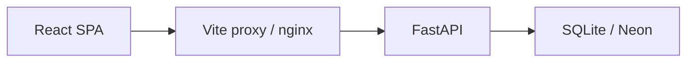

# Notes API — FastAPI learning project

[](https://github.com/vitali-breida/bmad-python-fastapi/actions/workflows/ci.yml)

A **FastAPI + React** notes app built to practice production-minded patterns — JWT auth, Alembic migrations, TanStack Query, CI with coverage gates, and ADR-driven decisions — deployed on Render's free tier as a portfolio piece, not a tutorial clone.

**Live preview (v0.4.10 after next deploy):** https://bmad-python-fastapi.onrender.com/

---

## Table of contents

- [What this is](#what-this-is)
- [Architecture at a glance](#architecture-at-a-glance)
- [Quality & security](#quality--security)
- [Quick start](#quick-start)
- [Product version](#product-version)
- [Web UI (React)](#web-ui-react)
- [Run locally with Docker](#run-locally-with-docker)
- [Try the API](#try-the-api)
- [Database migrations](#database-migrations)
- [Tests](#tests)
- [Continuous integration](#continuous-integration)
- [Preview deploy (Render)](#preview-deploy-render)
- [Project layout](#project-layout)
- [Next learning steps](#next-learning-steps)

---

## What this is

This repository is a **coherent learning project**, not a pile of experiments. The goal is to understand how real full-stack apps are structured and to show reviewers — in about two minutes — that architectural choices were deliberate.

| Signal | What it demonstrates |
|--------|----------------------|
| **Stateless JWT** | Thin routers, `Depends(get_current_user)`, no session store |
| **Same-origin deploy** | Vite proxy in dev, nginx in prod — no CORS middleware |
| **Migrations** | Alembic revision chain with brownfield upgrade paths |
| **CI + coverage** | pytest ≥85%, Playwright e2e, three-job GitHub Actions pipeline |
| **ADR discipline** | Decisions documented before implementation |
| **Visible Quality** | Design tokens + axe a11y baseline (Phase 1); README + security narrative (Phase 2) |

Breaking change from v0.4.0: all `/notes` endpoints require `Authorization: Bearer <access_token>`. Obtain a token via `POST /auth/login` (bootstrap `admin` user — see `.env.example`).

---

## Architecture at a glance



**Three tiers:** browser UI → reverse proxy (same origin) → API → database (SQLite locally, Neon Postgres on preview).

Full diagrams (auth sequence, CI pipeline) and text layout trees: **[`docs/architecture.md`](docs/architecture.md)**

Security trade-offs (JWT storage, CORS absence, headers deferral): **[`docs/security.md`](docs/security.md)**

---

## Quality & security

Evidence a reviewer can verify without running the app:

| Dimension | Artifact |
|-----------|----------|
| **Security narrative** | [`docs/security.md`](docs/security.md) — JWT, `sessionStorage`, same-origin, production guards, explicit header deferrals |
| **Architecture** | [`docs/architecture.md`](docs/architecture.md) — Mermaid system + auth + CI overview |
| **Accessibility** | [`frontend/docs/accessibility.md`](frontend/docs/accessibility.md) — axe baseline, focus rings, skip link (ADR-011) |
| **Test coverage policy** | [ADR-010](_bmad-output/planning-artifacts/adr/adr-010-test-coverage-and-quality-policy.md) — ≥85% backend, e2e critical paths |
| **Decision records** | [`_bmad-output/planning-artifacts/adr/`](_bmad-output/planning-artifacts/adr/) — JWT (003), deploy (004), routing (008), quality (011–012) |
| **Release compatibility** | [`docs/releases/compatibility.md`](docs/releases/compatibility.md) |

---

## Quick start

**Prerequisites:** Python 3.11+, Node.js (for UI), Git. Copy `.env.example` to `.env` and set `SECRET_KEY` + `INITIAL_ADMIN_PASSWORD` before auth (see [Web UI](#web-ui-react) for venv and UI steps).

```powershell
pip install -r requirements.txt
alembic upgrade head
python -m uvicorn app.main:app --reload
```

Use a **single worker** with the default SQLite file (multi-worker Uvicorn locks SQLite).

Open http://127.0.0.1:8000/docs for the API. For the React UI, run `npm run dev` in `frontend/` (second terminal).

Details below: [Web UI](#web-ui-react) · [Docker](#run-locally-with-docker) · [Migrations](#database-migrations) · [Render deploy](#preview-deploy-render)

---

## Product version

The **single product semver** lives in the root [`VERSION`](VERSION) file (plain text, one line, no `v` prefix). That is the only manual bump point for releases (ADR-006).

| Where | What you see |
|-------|----------------|
| Web UI footer | `v0.4.10` on the login screen and Notes home (bottom of page) |
| API | `GET /health` → `{"status":"ok","version":"0.4.10"}`; OpenAPI `info.version` matches |
| Release notes | [`CHANGELOG.md`](CHANGELOG.md); deploy policy in [`docs/releases/compatibility.md`](docs/releases/compatibility.md) |

**Bump a release:** edit `VERSION`, add a section to `CHANGELOG.md`, mirror `frontend/package.json` `version`, rebuild the Docker image with build-args from `VERSION` (below).

```powershell
curl http://127.0.0.1:8000/health
```

Local Vite dev reads root `VERSION` via `vite.config.ts` (`VITE_APP_VERSION` at build). Docker sets `APP_VERSION` on the API container and `VITE_APP_VERSION` when building the frontend stage.

---

## Web UI (React)

The `frontend/` app is a Vite + React + TypeScript + Tailwind multi-page SPA with **React Router** (ADR-008). In development it proxies `/notes`, `/auth`, and `/health` to the API. Sign in stores the JWT in `sessionStorage` — see [`docs/security.md`](docs/security.md) for the XSS trade-off.

**Routes (v1):**

| Path | Page | Access |
|------|------|--------|
| `/login` | Login | Public |
| `/dashboard` | Dashboard (post-login home) | Protected |
| `/notes` | Notes list + create form | Protected |
| `/notes/:id` | Note detail (edit/delete) | Protected |
| `/settings` | Profile + logout | Protected |
| `/` | Redirect → `/dashboard` or `/login` | — |

**Server state** uses [**TanStack Query**](https://tanstack.com/query) (ADR-005/007): `useQuery` / `useMutation`, shared `queryKeys`, optimistic updates, prefetch. **UI state** (forms, dialogs) stays page-local in `useState`. React Query DevTools load in dev only (`npm run dev`).

Layout: `pages/` → `hooks/` → `api/` → `query/`. Router shell in `App.tsx`; shared chrome in `layouts/AppLayout.tsx`. ADR: `_bmad-output/planning-artifacts/adr/adr-008-frontend-routing-v1.md`.

### Local setup (detailed)

**Terminal 1 — API** (from project root):

```powershell
python -m venv .venv
.\.venv\Scripts\Activate.ps1
pip install -r requirements.txt
copy .env.example .env
$env:SECRET_KEY = "change-me-local-only"
$env:INITIAL_ADMIN_PASSWORD = "change-me-local-only"
alembic upgrade head
python -m uvicorn app.main:app --reload
```

The API loads `.env` from the project root on startup (`python-dotenv`). Alembic does not load `.env` automatically — export `INITIAL_ADMIN_PASSWORD` or run migrations from a shell that has it.

**Terminal 2 — UI:**

```powershell
cd frontend
npm install
npm run dev
```

Open http://127.0.0.1:5173 — sign in as `admin`, land on `/dashboard`.

### Frontend checks

From `frontend/`:

```powershell
npm run lint
npm run build
```

### Frontend E2E (Playwright)

Starts the API (`scripts/e2e-api.sh`: migrations + Uvicorn on port 8000) and the Vite dev server automatically. Requires `INITIAL_ADMIN_PASSWORD` in the environment (same as Alembic bootstrap — use your `.env` value locally).

```powershell
cd frontend
$env:INITIAL_ADMIN_PASSWORD = "change-me-local-only"
npm run test:e2e
```

Asserts the version footer (`build-info`) on `/login` and after signing in (lands on `/dashboard`).

CI-style run (retries, fresh servers — same as GitHub Actions):

```powershell
cd frontend
$env:CI = "true"
$env:INITIAL_ADMIN_PASSWORD = "e2e-ci-admin-password"
npm run test:e2e
```

---

## Run locally with Docker

Uses the same image as [preview deploy](#preview-deploy-render): nginx serves the production Vite build and proxies `/notes`, `/auth`, `/health`, and `/docs` to Uvicorn inside the container. Good for checking **production-like** behavior; for day-to-day UI work with hot reload and Query DevTools, use [Quick start](#quick-start) (venv + `npm run dev`) instead.

**Prerequisites:** [Docker](https://www.docker.com/) (e.g. Docker Desktop on Windows).

From the project root (`.env` must exist — copy from `.env.example`; needs `SECRET_KEY` and `INITIAL_ADMIN_PASSWORD`):

```powershell
cd c:\Projects\bmad-python-fastapi

$version = (Get-Content VERSION -Raw).Trim()
docker build -t notes-app:local --build-arg "APP_VERSION=$version" --build-arg "VITE_APP_VERSION=$version" .

docker run --rm -p 10000:10000 --env-file .env -v notes-sqlite:/app notes-app:local
```

- App: http://127.0.0.1:10000  
- Sign in: `admin` + password from `INITIAL_ADMIN_PASSWORD` in `.env`  
- Health: http://127.0.0.1:10000/health  

The named volume `notes-sqlite` keeps `notes.db` across container restarts. To map a host file instead: `-v ${PWD}/notes.db:/app/notes.db` (create an empty file first or let the entrypoint create the DB on first run).

Do not set `ENVIRONMENT=production` in `.env` for this local Docker run unless you also set a Postgres `DATABASE_URL` — the production guard rejects SQLite.

To use another host port: `-p 8080:10000` → http://127.0.0.1:8080

---

## Try the API

All `/notes` calls require a Bearer token (v0.4.0). Log in first, then paste `access_token` from the JSON response:

```powershell
# 1) Obtain a token (use your bootstrap admin password from INITIAL_ADMIN_PASSWORD)
curl -X POST http://127.0.0.1:8000/auth/login -d "username=admin&password=change-me-local-only"

# 2) Replace <access_token> with the token from step 1
curl http://127.0.0.1:8000/notes -H "Authorization: Bearer <access_token>"
curl -X POST http://127.0.0.1:8000/notes -H "Authorization: Bearer <access_token>" -H "Content-Type: application/json" -d "{\"title\":\"My first note\",\"body\":\"Hello FastAPI\"}"
curl http://127.0.0.1:8000/notes/1 -H "Authorization: Bearer <access_token>"
```

Or use **Authorize** on `/docs` (username/password → token sent on **Try it out** for `/notes`).

Notes are stored in `notes.db` in the project root after migrations are applied.

---

## Database migrations

Schema is managed with [Alembic](https://alembic.sqlalchemy.org/). Apply all revisions:

```powershell
alembic upgrade head
```

Revision chain:

1. `001_baseline_notes` — `notes` table (`id`, `title`, `body`)
2. `002_add_notes_updated_at` — adds nullable `updated_at` (`DateTime(timezone=True)`)
3. `003_add_users_table` — `users` table + bootstrap `admin` (requires `INITIAL_ADMIN_PASSWORD` in the environment)

**Downgrade warning:** `alembic downgrade` past revision `003_add_users_table` **drops the `users` table** and removes bootstrap accounts. Back up `notes.db` before downgrading in environments that matter.

**Auth env (see `.env.example`):** `SECRET_KEY` (required for JWT; empty/whitespace = unset), `ACCESS_TOKEN_EXPIRE_MINUTES` (intended range 1–10080, default 60), `ENVIRONMENT` or `ENV` (`production` / `prod` triggers fail-fast for missing `SECRET_KEY` or non-Postgres `DATABASE_URL`), `INITIAL_ADMIN_PASSWORD` (migration only; strip applied on upgrade).

### Brownfield: `notes.db` from before Alembic

If you already have a database created by the older `create_all` flow (ADR-001) with the baseline columns only:

```powershell
alembic stamp 001_baseline_notes
alembic upgrade head
```

`stamp` records the baseline revision without changing schema; `upgrade head` adds `updated_at`.

### Brownfield: old Alembic revision ids (`001baseline`, `002updated_at`)

If `alembic_version` still has the short ids from an earlier checkout, rename before upgrading:

```powershell
sqlite3 notes.db "UPDATE alembic_version SET version_num='001_baseline_notes' WHERE version_num='001baseline';"
sqlite3 notes.db "UPDATE alembic_version SET version_num='002_add_notes_updated_at' WHERE version_num='002updated_at';"
alembic upgrade head
```

### Fresh database

```powershell
$env:INITIAL_ADMIN_PASSWORD = "change-me-local-only"
alembic upgrade head
```

---

## Tests

```powershell
python -m pytest --cov=app --cov-fail-under=85 --cov-report=term-missing
```

Tests use an in-memory SQLite database via FastAPI dependency overrides (see `tests/conftest.py`). Migration behavior is covered in `tests/test_migrations.py`; production database guard in `tests/test_database.py`. CI enforces **≥85% line coverage** on `app/` per [ADR-010](_bmad-output/planning-artifacts/adr/adr-010-test-coverage-and-quality-policy.md) (baseline ~92%; checklist in [`quality-gates.md`](_bmad-output/implementation-artifacts/quality-gates.md)).

---

## Continuous integration

On every push and pull request to `main`, GitHub Actions runs three jobs (see [`.github/workflows/ci.yml`](.github/workflows/ci.yml)):

| Job | Checks |
|-----|--------|
| `backend` | `python -m pytest --cov=app --cov-fail-under=85` (Python 3.11) |
| `frontend` | `npm run lint`, `npm run build` (Node 24) |
| `e2e` | Playwright (`CI=true`; API + Vite; version footer on login and after sign-in) |

No repository secrets are required for CI. Pipeline diagram: [`docs/architecture.md`](docs/architecture.md#ci-pipeline).

---

## Preview deploy (Render)

**Live preview (ADR-004 complete, Neon Postgres, v0.4.10 after next deploy):** https://bmad-python-fastapi.onrender.com/

Manual deploy to a single HTTPS origin. The Docker image serves the Vite build via nginx and proxies `/notes`, `/auth`, `/health`, and `/docs` to Uvicorn on the same host (same relative paths as local dev). Free tier may sleep after idle (cold start on first visit).

### Operator checklist

1. [Render](https://render.com) account → connect this GitHub repo.
2. **New Web Service** → **Docker** → branch `main` → enable **manual deploy** (recommended while learning the stack).
3. Environment variables (never commit values):

   | Variable | Purpose |
   |----------|---------|
   | `SECRET_KEY` | JWT signing (required in production) |
   | `INITIAL_ADMIN_PASSWORD` | Bootstrap `admin` on first `alembic upgrade head` |
   | `ENVIRONMENT` | `production` (container exits at startup if `SECRET_KEY` or Postgres `DATABASE_URL` is missing/invalid) |
   | `DATABASE_URL` | **Required in production** — Neon Postgres URL (see [Phase 3](#phase-3-neon-postgres-persistence) below) |

4. In the Render service settings, set **Health Check Path** to `/health` (checks API via nginx, not only the static page).
5. Deploy manually; open the public URL and sign in as `admin`.

With `ENVIRONMENT=production`, the container **fails at startup** if `DATABASE_URL` is missing or points at SQLite — set a Neon Postgres URL before deploying (see Phase 3).

### Phase 3 — Neon Postgres (persistence)

Use this when preview notes must survive manual redeploys. Local development stays on SQLite; only the Render preview needs Neon.

1. Create a [Neon](https://neon.tech) project and copy the connection string (`postgresql://…`).
2. Ensure the URL includes `sslmode=require` (append `?sslmode=require` if Neon omits it).
3. In the Render dashboard, set `DATABASE_URL` to that string. Keep `SECRET_KEY`, `INITIAL_ADMIN_PASSWORD`, and `ENVIRONMENT=production`.
4. Trigger a **manual deploy**. Startup runs `alembic upgrade head` then production validation — check Render logs for migration errors.
5. **Persistence smoke:** sign in as `admin` → create a note with a distinctive title → manual redeploy → sign in again → note is still listed.

`psycopg[binary]` is already in `requirements.txt`; no code changes are required beyond setting env vars on Render.

Plan: `_bmad-output/implementation-artifacts/plan-ci-cd-phases.md` · ADR: `_bmad-output/planning-artifacts/adr/adr-004-ci-cd-and-preview-deployment.md`.

---

## Project layout

```
frontend/
  src/
    api/           # authFetch, notes/health API, ApiError
    hooks/         # useAuth, useNotes, useHealth (TanStack Query)
    query/         # QueryClient, keys, mapApiError
    pages/         # Login, Dashboard, NotesList, NoteDetail, Settings
    layouts/       # AppLayout (nav, footer)
    components/    # ProtectedRoute, NoteList, NoteForm, …
    App.tsx        # BrowserRouter + route tree
  e2e/             # Playwright smoke tests
app/
  main.py          # FastAPI app
  models.py        # Pydantic API schemas
  db_models.py     # SQLAlchemy table models (NoteRow, UserRow)
  database.py      # Engine, session, get_db, production DATABASE_URL guard
  store.py         # Repository (notes CRUD)
  auth/            # JWT config, security, deps, user lookup
  routers/notes.py # CRUD /notes (Bearer required from v0.4.0)
  routers/auth.py  # POST /auth/login, GET /auth/me
alembic/
  env.py           # Binds to app.database + Base.metadata
  versions/        # Migration revisions
tests/
  conftest.py
  test_notes.py
  test_migrations.py
  test_database.py
docs/
  architecture.md  # System + auth + CI diagrams
  security.md      # Security trade-offs narrative
```

---

## Next learning steps

- API versioning or pagination on `GET /notes`
- PostgreSQL for local dev (preview already uses Neon; same patterns, different `DATABASE_URL`)
- Security headers in nginx (CSP, HSTS) — see [`docs/security.md`](docs/security.md) backlog
- Deferred frontend: full CRUD E2E with live API (see TanStack Query plan backlog)
- Visible Quality Phase 3 — UI spark + Lighthouse perf budget ([`deferred-work.md`](_bmad-output/implementation-artifacts/deferred-work.md))
