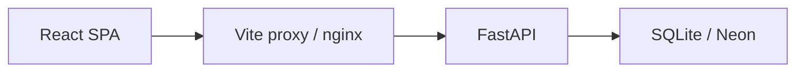

<frozen-after-approval reason="human-owned intent — do not modify unless human renegotiates">

## Intent

**Problem:** Phase 1 made the UI credible (ADR-011), but GitHub visitors still see a tutorial-style README with no architecture picture and no consolidated security story. Portfolio reviewers cannot tell in ~2 minutes that Vitali is the architect — infra reads as accidental, JWT/CORS/cookie choices are buried in ADR-003.

**Approach:** Phase 2 of **Visible Quality** (brainstorming 2026-06-10): **craft** (README voice + simple Mermaid diagram) + **evidence** (`docs/security.md` with explicit trade-offs). Docs-only — **no API, auth, or UI behavior changes**.

**Deferred (not this spec):**
- **Phase 3** — UI spark + Lighthouse perf budget (`deferred-work.md`)
- **Security headers implementation** — CSP/HSTS/nginx hardening (future infra epic)
- **CORS middleware** — same-origin remains; document only

## Boundaries & Constraints

**Always:** ADR-003 remains canonical for JWT implementation facts; Phase 2 **summarizes** for humans. Preserve operator-critical README content (migrations, Render checklist, Docker). English only. Relative links must work on GitHub.

**Ask First:** Any runtime code change; new npm/Python dependencies; CI workflow changes; removing migration/brownfield sections from README.

**Never:** Auth behavior changes; token storage migration; security header implementation; Phase 3 scope; deleting Render/Neon operator steps.

## I/O & Edge-Case Matrix

| Scenario | Input / State | Expected Output / Behavior | Error Handling |
|----------|--------------|---------------------------|----------------|
| README first screen | Visitor opens repo on GitHub | Sees project story, preview URL, architecture link, quality evidence links within first ~2 min scroll | N/A |
| Architecture diagram | `docs/architecture.md` on GitHub | Mermaid renders: browser → proxy/nginx → FastAPI → DB; CI summary | ≤3 Mermaid blocks (system + auth + CI — exception approved 2026-06-10 review) |
| Security narrative | Reviewer reads `docs/security.md` | JWT stateless model, sessionStorage + XSS trade-off, same-origin (no CORS v1), no auth cookies, production env guards, headers **deferred** with rationale | Link to ADR-003/004 for depth |
| Version table | README product version section | Matches root `VERSION` at ship time | Update during Workstream 4 |
| Stale links | Click README doc links | `docs/architecture.md`, `docs/security.md`, `frontend/docs/accessibility.md`, ADR paths resolve | Fix before sign-off |
| CI regression | No code changes | All existing jobs green | N/A |
| Auth unchanged | Login → notes flow | Identical behavior | E2E 7/7 pass |

</frozen-after-approval>

## Code Map

- `docs/security.md` — NEW: security trade-offs narrative (JWT, storage, same-origin, cookies, headers posture, secrets, production guards)
- `docs/architecture.md` — NEW: Mermaid system diagram + simplified auth flow + CI overview
- `README.md` — REFACTOR: story-first structure; link new docs; fix stale version refs; retain operator sections
- `CHANGELOG.md` — ADR-012 Phase 2 entry
- `VERSION` — PATCH `0.4.9` → `0.4.10`
- `frontend/package.json` — mirror version (ADR-006)
- `_bmad-output/implementation-artifacts/deferred-work.md` — ADR-012 complete; Visible Quality Phase 3 remains deferred
- `_bmad-output/project-context.md` — pointer to `docs/security.md`; sync preview version + e2e count with `VERSION` / current suite
- `_bmad-output/planning-artifacts/adr/adr-012-visible-quality-phase2.md` — implementation status table at epic close

**Unchanged:** `app/`, `frontend/src/`, CI workflows, nginx template, auth code.

## Tasks & Acceptance

**Naming:** This epic is **Visible Quality Phase 2** (ADR-012). Workstreams 1–4 below are implementation order — not ADR-011 Phase 1.

### Workstream 1 — Security narrative (`docs/security.md`)

- [x] Create `docs/security.md` with sections: **Scope & threat model** (learning app, free-tier preview, no multi-tenant prod); **Authentication** (stateless JWT, link ADR-003); **Token storage** (`sessionStorage`, XSS trade-off, why not httpOnly cookie in v1); **Transport & origin** (HTTPS on Render; dev Vite proxy; **no CORS** because same-origin); **Cookies** (not used for auth); **Secrets** (`SECRET_KEY`, `INITIAL_ADMIN_PASSWORD`, never commit); **Production guards** (`ENVIRONMENT=production`, Postgres `DATABASE_URL`); **Headers posture** (list headers not set: CSP, HSTS, `X-Frame-Options`, `X-Content-Type-Options` — defer with rationale; cite `deploy/nginx.conf.template` as current evidence); **Out of scope / backlog** (rate limiting, RBAC, refresh tokens, row-level authz)
- [x] Cross-link ADR-003, ADR-004, ADR-010, ADR-011 Phase 1 a11y doc

**Workstream 1 acceptance:**
- Given a technical reviewer, when they read `docs/security.md`, then JWT + same-origin + sessionStorage trade-offs are explicit without reading full ADR-003.
- Given security doc, when searching "CORS", then doc states same-origin strategy and why CORS middleware is absent.

### Workstream 2 — Architecture diagram (`docs/architecture.md`)

- [x] Create `docs/architecture.md` with **System overview** Mermaid: Browser SPA → (Vite dev proxy | nginx prod) → FastAPI → SQLite local / Neon preview
- [x] Add **Auth flow** Mermaid (simplified login → JWT → Bearer on API) — may adapt ADR-003 sequence, fewer nodes
- [x] Add **CI overview** (backend / frontend / e2e jobs) — table or small diagram
- [x] Link to relevant ADRs (`adr-003`, `adr-004`, `adr-008`, `adr-011`)

**Workstream 2 acceptance:**
- Given GitHub render, when viewing `docs/architecture.md`, then at least one Mermaid diagram displays without syntax errors.
- Given diagram, when traced left-to-right, then a non-expert can name the three tiers (UI, API, DB).

### Workstream 3 — README rewrite

- [x] Reorder README: title + badge + one-liner + **preview URL** → **What this is** → **Architecture at a glance** (inline compact Mermaid or link) → **Quality & security** (links to `docs/security.md`, `frontend/docs/accessibility.md`, ADR folder) → **Quick start** → detailed sections below
- [x] Fix stale version references (e.g. `v0.4.5` → current `VERSION`)
- [x] Add pointer to `docs/architecture.md` and `docs/security.md`
- [x] Merge or replace legacy **Architecture notes** ADR table with links to `docs/architecture.md` + `docs/security.md` (avoid duplicate ADR index)
- [x] Retain: Docker local, migrations/brownfield, CI table, Render operator checklist, API curl examples, project layout
- [x] Add Table of Contents if README exceeds ~300 lines after rewrite (recommended — baseline README is already ~317 lines)

**Workstream 3 acceptance:**
- Given README only, when author reads top half, then project story + preview + quality evidence are clear in ≤2 minutes.
- Given README links, when clicked on GitHub, then architecture, security, and accessibility docs open correctly.

**Author craft gate (manual):**
- [ ] **README sounds like my voice, not a template tutorial** — Vitali, date: ___

### Workstream 4 — Release hygiene + tracking

- [x] `VERSION` + `frontend/package.json` PATCH `0.4.10`
- [x] `CHANGELOG.md` — Visible Quality Phase 2 entry (README, architecture doc, security doc)
- [x] `deferred-work.md` — add **ADR-012 complete** under Visible Quality; move Phase 2 from deferred → done; keep Phase 3 (spark + perf) deferred
- [x] ADR-012 implementation status table → Done
- [x] `project-context.md` — one line under auth or quality rules pointing to `docs/security.md`; update preview version string and e2e count (21) to match ship state

**Workstream 4 acceptance:**
- Given `VERSION` file, when compared to README version table, then values match.
- Given `deferred-work.md`, when Visible Quality section read, then ADR-012 Phase 2 is marked complete and Phase 3 remains deferred.

## Design Notes

### README voice (suggested opening tone)

Lead with **intent**, not dependencies: a FastAPI + React learning project with production-minded patterns (JWT, migrations, CI, ADR discipline) deployed on Render free tier — built to understand real apps and to demonstrate architectural authorship to reviewers.

### Inline Mermaid for README (suggested compact block)

Full detail lives in `docs/architecture.md`.

### `docs/security.md` outline (normative)

1. Purpose & audience  
2. Threat model (honest scope)  
3. Authentication model (JWT, ADR-003 link)  
4. Client token storage (`sessionStorage`)  
5. Same-origin & CORS (why absent)  
6. Cookies (not used)  
7. Secrets & env vars  
8. Production startup guards  
9. Security headers — documented deferral  
10. Related ADRs & further reading  

### Headers deferral rationale (for security doc)

Preview is a **learning deployment** on Render free tier with **no real users** and **same-origin** nginx. Implementing CSP without breaking Vite dev workflow or `/docs` Swagger requires coordinated frontend nonce strategy — out of scope. Document **what** would be added before a production launch (HSTS via Render HTTPS, baseline nginx headers, CSP policy draft).

### Epic type (ADR-010)

**Docs-only / no UX change** → Test delta plan: **0 pytest, 0 e2e**. All existing tests must pass.

## Verification

**Commands (no code delta expected):**
- `python -m pytest --cov=app --cov-fail-under=85 --cov-report=term-missing` — pass
- `cd frontend && npm run lint` — pass
- `cd frontend && npm run build` — pass
- `cd frontend && npm run test:e2e` — pass (API :8000)

**Manual checks:**
- Read README top-to-bottom as interviewer — 2-minute story test
- Open `docs/architecture.md` on GitHub (or VS Code Mermaid preview) — diagrams render
- Read `docs/security.md` — trade-offs explicit; no false claims (e.g. do not claim CSP is enabled)
- Click all new relative links from README

## Coverage baseline (epic start)

Canonical baseline at epic kickoff (`4048992a`, 2026-06-10): backend **92%**, pytest **35**, e2e **21**, critical paths **7/7**.

## Test delta (plan)

| Type | Min new |
|------|---------|
| pytest | 0 |
| e2e | 0 |

Epic type: **docs-only** (ADR-010 Rule 3 — refactor / no UX change).

## Test delta (actual — epic sign-off)

| Type | Before | After | Delta | Plan met? |
|------|--------|-------|-------|-----------|
| pytest | 35 | 35 | 0 | [x] |
| e2e | 21 | 21 | 0 | [x] |

## Quality Gates

See canonical checklist: `_bmad-output/implementation-artifacts/quality-gates.md`

- [x] UX/spec scope documented (explicit in / out of scope)
- [x] All phase acceptance criteria marked complete in this spec (author craft gate pending Vitali)
- [x] `bmad-code-review` complete — 0 open Patch items (Defer → `deferred-work.md`)
- [x] `python -m pytest --cov=app --cov-fail-under=85 --cov-report=term-missing` — pass (from project root)
- [x] `cd frontend && npm run lint` — pass
- [x] `cd frontend && npm run build` — pass
- [x] `cd frontend && npm run test:e2e` — pass (API on :8000)
- [x] Manual smoke from spec Verification section — pass (record date below)
- [x] `project-context.md` updated (security pointer, preview version, e2e count per Workstream 4)
- [x] `CHANGELOG.md` + `VERSION` bumped if user-visible release
- [x] New deferrals added to `deferred-work.md` with reason
- [x] Coverage policy sign-off (Rules 1–4) — see Coverage policy section below

**Manual smoke date:** 2026-06-10
**Reviewer / sign-off:** pending author craft gate + code review
**Coverage after:** 93% (Δ +0.9% vs baseline)

### Coverage sign-off

- [x] Rule 1: CI backend job green (≥85%)
- [x] Rule 2: CI e2e job green (7/7 critical paths)
- [x] Rule 3: Test delta (actual) ≥ plan (0/0)
- [x] Rule 4: coverage delta ≥ −2% or deferred in `deferred-work.md`

## Suggested Review Order

**Security narrative (evidence)**

- Trade-offs doc
  [`docs/security.md`](../../docs/security.md)

**Architecture (craft)**

- System diagram
  [`docs/architecture.md`](../../docs/architecture.md)

**Portfolio entry point**

- Story-first README
  [`README.md`](../../README.md)

**Tracking**

- Deferred work sync
  [`deferred-work.md`](deferred-work.md)

## Spec Change Log

### Ready — 2026-06-10

- Initial spec from brainstorming Visible Quality Phase 2 + ADR-012 acceptance.
- Docs-only epic; 0 test delta; PATCH version bump for README release.

### Validation hygiene — 2026-06-10

- pytest baseline 28 → 35; `baseline_commit` pinned to `4048992a`.
- Workstreams 1–4 naming (vs Visible Quality Phase 2 epic).
- Phase 4 fixes: ADR-012 deferred-work sync; mandatory `project-context.md` updates.
- README: merge Architecture notes table; TOC recommended; nginx template cited in security doc task.

### Implemented — 2026-06-10

- Workstreams 1–4 complete; v0.4.10; pytest 35/35, e2e 21/21, coverage 93%.
- Author craft gate remains for human sign-off.

### Code review patches — 2026-06-10

- Vitali: **1c** (3 Mermaid blocks — I/O exception), **2a** (Quick start teaser). All Patch findings applied; 4 Defer items in `deferred-work.md`.

### Review Findings — 2026-06-10

- [x] [Review][Decision] **Mermaid block count vs spec I/O cap** — Resolved **1c**: keep 3 blocks; I/O matrix updated with approved exception.

- [x] [Review][Decision] **Quick start command count vs ADR-012 norm** — Resolved **2a**: 3-command teaser in README Quick start; detailed steps under Web UI § Local setup.

- [x] [Review][Patch] **Live preview version ahead of deploy** [README.md:7, README.md:301, project-context.md:131] — Added “after next deploy” qualifier.

- [x] [Review][Patch] **Quick start omits SECRET_KEY setup** [README.md:90] — Prerequisites + detailed Web UI block show `SECRET_KEY`.

- [x] [Review][Patch] **Single-worker SQLite guard removed** [README.md] — Restored under Quick start.

- [x] [Review][Patch] **Broken relative path to deferred-work** [README.md:382] — Fixed link to `_bmad-output/implementation-artifacts/deferred-work.md`.

- [x] [Review][Patch] **“Folder layout” diagram over-promise** [README.md:60] — Wording changed to “text layout trees”.

- [x] [Review][Patch] **SECRET_KEY whitespace claim inaccurate** [docs/security.md:103] — Aligned with `get_secret_key()` behavior.

- [x] [Review][Patch] **Frontend layout tree incomplete** [docs/architecture.md:108] — Added `components/`.

- [x] [Review][Patch] **CI diagram omits a11y evidence path** [docs/architecture.md:84] — Noted axe via `test:e2e` / `test:a11y`.

- [x] [Review][Patch] **ADR-012 Compliance checkboxes stale** [adr-012-visible-quality-phase2.md:148] — CI gates marked pass.

- [x] [Review][Defer] **Public login rate limiting unmitigated** [docs/security.md:22] — Threat table lists credential guessing in-scope; rate limiting deferred to §11. Pre-existing scope gap; track in backlog.

- [x] [Review][Defer] **XSS mitigation claim without CI enforcement** [docs/security.md:59] — “No dangerouslySetInnerHTML” is manual discipline, not lint-gated. Pre-existing.

- [x] [Review][Defer] **Windows-only Docker path in README** [README.md:187] — Hardcoded `c:\Projects\...` predates ADR-012; cross-platform polish deferred.

- [x] [Review][Defer] **Bootstrap credential narrative on public preview** [docs/security.md] — No dedicated callout for `INITIAL_ADMIN_PASSWORD` on public demo URL. Enhancement deferred.
