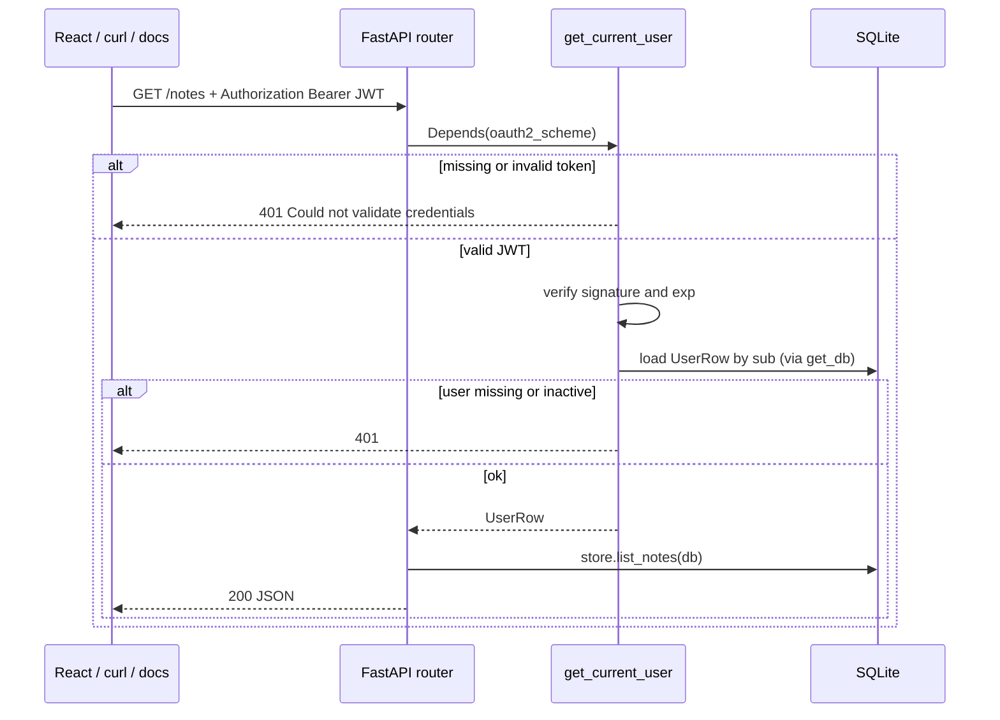

# ADR-003: Stateless JWT authentication for Notes API

**Status:** Accepted  
**Date:** 2026-05-21  
**Accepted:** 2026-05-21 (two document review cycles; no open blockers)  
**Scope:** Authentication only (identity + block anonymous API). Authorization (roles, permissions) is explicitly deferred to a follow-up ADR.  
**Session:** `_bmad-output/brainstorming/brainstorming-session-2026-05-21-1425.md`

## Context

The Notes API (FastAPI + SQLite + Alembic + React UI) currently exposes CRUD `/notes` without identity checks. The learning goal is to add **production-realistic authentication** using **stateless JWT** and FastAPI dependency injection — the same pattern as existing `Depends(get_db)`.

**Not in scope for this ADR:** session cookies, OAuth2 social login, refresh-token rotation (optional later), RBAC/permissions, admin matrix, row-level “only my notes” enforcement, `owner_id` on notes (deferred to authz ADR), self-service registration.

## Decision

| Area | Choice |
|------|--------|
| Auth model | **Stateless JWT** (signed access token, no server-side session store) |
| Token transport | `Authorization: Bearer <access_token>` on protected routes |
| Login | `POST /auth/login` — OAuth2 password flow (`application/x-www-form-urlencoded`) |
| Identity in handlers | `current_user: UserRow = Depends(get_current_user)` |
| ORM / API schemas | `UserRow` in `db_models.py` (like `NoteRow`); `UserRead` in `models.py` for responses — never expose `hashed_password` |
| `get_current_user` | After JWT verify: `Depends(get_db)` → load `UserRow` by `sub`; 401 if missing, invalid `sub`, or `is_active` is false |
| Unauthenticated access | **401 Unauthorized** on protected routes (no anonymous CRUD) |
| Password storage | One-way hash via **`pwdlib[bcrypt]`** |
| User persistence | SQLAlchemy `users` table + Alembic **`003_add_users_table`** (`revision` id = filename stem; `down_revision = 002_add_notes_updated_at`) |
| User lookup | `app/auth/users.py` — not `store.py`; **trim username** in `get_user_by_username` before DB lookup (login now; register later) |
| Bootstrap user | Seed **`admin`** in migration `upgrade()` only; hash from env `INITIAL_ADMIN_PASSWORD` (upgrade **fails** if unset); idempotent insert; no `POST /auth/register` in v1 |
| Username rules | Unique **case-sensitive**; min length **3**; max length **64** (DB column); trim on login; UI hint that username is case-sensitive (optional) |
| Token claims | `sub` = user id (string), `exp` = expiry (UTC) |
| Signing | HS256; decode uses **algorithm allowlist** (`algorithms=[ALGORITHM]` only — no `alg` confusion); **`SECRET_KEY`** required in prod (no default, fail fast; empty/whitespace treated as unset); local dev may use documented placeholder in `.env.example` only |
| Login (inactive user) | `is_active = false` → **401** with same generic message as wrong password (do not reveal “disabled account”) |
| JWT library | **`PyJWT`** |
| Token TTL | Default **60 minutes**; override via `ACCESS_TOKEN_EXPIRE_MINUTES` in range **1–10080** (invalid or out-of-range → fail fast at app startup) |
| API version | Bump to **`0.4.0`**; README notes breaking change (all `/notes` require Bearer) |
| Notes schema | **No `owner_id`** in authn migration — wait for authz ADR |
| Protected surface | All `/notes/*` and **`GET /auth/me`**; `/health` and `POST /auth/login` remain public |
| OpenAPI / Swagger | `/docs`, `/openapi.json` public; protected ops use `OAuth2PasswordBearer(tokenUrl="/auth/login")` + **Authorize** |
| Post-login identity | `GET /auth/me` returns safe user profile (no password hash) |
| Authorization | **Deferred** — any authenticated user may use all note operations until ADR-00x authz |

### Rationale

- Matches FastAPI docs (`OAuth2PasswordBearer`, JWT examples) and existing **thin router + Depends** style.
- Aligns with React SPA: store token client-side, attach header per request; Vite dev proxy extended with `/auth` (same pattern as `/notes` — no `:8000` in frontend code).
- Tests can override `get_current_user` like `get_db` (`dependency_overrides`).
- Stateless JWT avoids Redis/session infrastructure on a learning SQLite stack.
- Authn can ship before roles/permissions without redesigning login.

### Alternatives considered (rejected for this increment)

| Alternative | Why not now |
|-------------|-------------|
| Session cookie + server session | User chose JWT; cookie flow deferred |
| API keys only | Poor fit for interactive UI login |
| JWT + refresh tokens | Optional follow-up; keep v1 to access token only |

## Architecture

### Request flow (protected route)



### Login flow

```mermaid
sequenceDiagram
    participant Client
    participant API as POST /auth/login
    participant DB

    Client->>API: username + password (form)
    API->>DB: find user by username (trim first)
    API->>API: verify password; reject if is_active false
    alt invalid or inactive
        API-->>Client: 401 invalid credentials
    else ok
        API->>API: create_access_token(sub=user.id)
        API-->>Client: access_token, token_type bearer
    end
```

### Module layout (proposed)

```
app/
  auth/
    __init__.py
    config.py       # SECRET_KEY, ALGORITHM, ACCESS_TOKEN_EXPIRE_MINUTES
    security.py     # hash_password, verify_password, create_access_token, decode_token
    deps.py         # oauth2_scheme, get_current_user (uses Depends(get_db))
    users.py        # get_user_by_username, get_user_by_id
  db_models.py      # + UserRow ORM model
  models.py         # + Token, UserRead (Pydantic response schema)
  routers/
    auth.py         # POST /auth/login, GET /auth/me
    notes.py        # add Depends(get_current_user) on all handlers
alembic/versions/   # 003_add_users_table.py — revision id 003_add_users_table
```

**Conventions (from `project-context.md`):**

- Routers stay thin; no SQL in routers.
- Password and JWT logic live under `app/auth/`, not in `store.py`.
- `store.py` remains notes CRUD only; user lookup in **`app/auth/users.py`**.
- Naming mirrors notes: `NoteRow` / `Note` → `UserRow` / `UserRead`.

### `get_current_user` (explicit)

1. Read `Authorization: Bearer` via `OAuth2PasswordBearer`.
2. Decode and validate JWT (`sub`, `exp`, signature).
3. Open DB session via `Depends(get_db)`; parse `sub` as user id — **401** if not an integer or user missing (never **500** on bad `sub`).
4. If row missing or `is_active` is false → 401.
5. Return `UserRow` to the route handler.

JWT alone is not enough — the DB check covers deleted/disabled users after the token was issued.

## Data model

### Table: `users`

| Column | Type | Notes |
|--------|------|-------|
| `id` | Integer PK | |
| `username` | String(64), unique, indexed | Case-sensitive unique; min length 3 after trim (login); max 64 chars (column limit) |
| `hashed_password` | String | Never expose via API |
| `is_active` | Boolean, default true | Inactive → 401 in `get_current_user` |

**Seed / bootstrap:** Alembic revision **`003_add_users_table`** creates `users` and inserts `admin` in `upgrade()` using **`INITIAL_ADMIN_PASSWORD`** (strip whitespace; reject missing or empty after strip; optional min length 8 — see migration/README). If env is missing or blank, **upgrade fails** with a clear error. Insert is **idempotent** (skip if `admin` already exists). **`downgrade`** on `003` **drops the `users` table** (see README). Document in README + `.env.example`; never commit real passwords. **pytest** uses `create_all` + **`test_user` fixture** — migration seed does not run there. No `POST /auth/register` in v1.

### Alembic naming (readable revision ids)

**Convention:** `revision` string = filename without `.py` (e.g. `003_add_users_table.py` → `revision = "003_add_users_table"`). Easier to read in `alembic history` and docs than short opaque ids.

| Revision ID | File | `down_revision` |
|-------------|------|-----------------|
| `001_baseline_notes` | `001_baseline_notes.py` | — |
| `002_add_notes_updated_at` | `002_add_notes_updated_at.py` | `001_baseline_notes` |
| **`003_add_users_table`** | **`003_add_users_table.py`** | **`002_add_notes_updated_at`** |

**Brownfield:** DBs already stamped with old ids (`001baseline`, `002updated_at`) must update `alembic_version.version_num` to the new strings (see README) before `upgrade head`.

**Notes schema:** unchanged in this ADR — no `owner_id` until authz ADR defines “my notes only”.

## API contract

### `POST /auth/login`

- **Auth:** none (public)
- **Body:** `application/x-www-form-urlencoded` — `username`, `password` (trim username before lookup; OAuth2 password grant shape for Swagger). Wrong Content-Type (e.g. JSON) → **422**.
- **200:** `{ "access_token": "<jwt>", "token_type": "bearer" }`
- **401:** invalid credentials (generic message; wrong password, **empty password**, unknown username, **whitespace-only or short username after trim** (length &lt; 3), or **`is_active = false`** — same wording for all)

### `GET /auth/me`

- **Auth:** Bearer JWT required
- **200:** `{ "id": 1, "username": "alice" }` (`response_model=UserRead`)
- **401:** missing/invalid token, malformed `Authorization` (not `Bearer`), invalid/expired JWT, non-integer or ≤ 0 `sub`, missing user, or inactive user

### `/notes/*`

- **Auth:** Bearer JWT required on all existing CRUD endpoints
- **401:** no/invalid token
- **Behavior until authz ADR:** authenticated users retain full CRUD on all notes (current global note list)

### Public endpoints

| Path | Reason |
|------|--------|
| `GET /health` | Load balancers / smoke |
| `POST /auth/login` | Obtain token |
| `/docs`, `/openapi.json` | Local learning UX (HTML/schema only — not a bypass for CRUD) |

### OpenAPI / Swagger (`/docs`)

- **Page** `/docs` is public — anyone can open the UI and read schemas.
- **Try it out** on `/notes/*` requires a Bearer token (same as React/curl); without **Authorize** → **401**.
- Implementation: `OAuth2PasswordBearer(tokenUrl="/auth/login")` in `get_current_user` + `Depends(get_current_user)` on protected handlers — FastAPI adds security to the OpenAPI spec (lock icons, **Authorize** dialog).
- Manual test flow: `POST /auth/login` (or Authorize with username/password) → copy/use `access_token` → call `/notes` from docs.

## Security notes (review checklist)

Mark items `[x]` after implementation (e.g. in final auth PR or README “Security checklist for v0.4.0”).

- [x] `SECRET_KEY` required in prod (`ENVIRONMENT` or `ENV` = `production` / `prod`); empty/whitespace treated as unset; dev placeholder only in `.env.example` (`.env` not committed)
- [x] JWT decode: HS256 allowlist only (`algorithms=[ALGORITHM]` in `decode_access_token`)
- [x] Passwords: bcrypt (or approved equivalent); never log passwords or tokens
- [x] JWT payload minimal: `sub`, `exp` only (no roles in token until authz ADR defines claim strategy)
- [x] HTTPS assumed for real deployment; local HTTP acceptable for learning
- [x] Token storage on frontend: document trade-off (`sessionStorage` vs memory) — XSS awareness for reviewers
- [x] No “logout” endpoint required for stateless JWT (client discards token); optional denylist out of scope
- [ ] Rate limiting on `/auth/login` — optional follow-up (deferred)
- [x] All `/notes` handlers use `Depends(get_current_user)` so Swagger shows **Authorize** and sends Bearer on Try it out

## Dependencies (implementation)

Add to `requirements.txt` (exact pins at implementation time):

- `PyJWT` — JWT encode/decode
- `pwdlib[bcrypt]` — password hashing

## Testing strategy

**Idea:** most note tests keep using `dependency_overrides` (like today’s `get_db`); at least one test exercises the real path **login → Bearer → `/notes`**. Tests that call login need a **seed user row** in the DB — empty `users` always yields 401.

### Two modes

| Mode | How | Use for |
|------|-----|---------|
| **A — bypass JWT** | `app.dependency_overrides[get_current_user]` returns a fixture `UserRow` | Existing note CRUD tests; stay fast, no token plumbing |
| **B — real auth** | Fixture inserts test user → `POST /auth/login` → `Authorization: Bearer` on `/notes` | One integration test proving auth wiring end-to-end |

### `conftest` expectations

- `Base.metadata.create_all` in the test fixture already creates all tables; once `UserRow` exists, `users` is included automatically.
- Add a **`test_user` fixture** (known `username` / password, `is_active=True`) inserted into the session **before** login tests — `create_all` does not insert rows.
- Clear **both** `get_db` and `get_current_user` overrides in fixture teardown (same pattern as today).

### Test cases

| Test | Expectation |
|------|-------------|
| `POST /auth/login` valid user (with seed) | 200 + `access_token` |
| `POST /auth/login` wrong password or inactive user | 401 (same generic body) |
| `GET /notes` without header | 401 |
| `GET /notes` with valid Bearer (mode B) | 200 (existing note behavior) |
| `GET /auth/me` with token | 200 + `UserRead` fields |
| Note CRUD suite (mode A) | Override `get_current_user`; no JWT required |
| `test_login_then_list_notes` (mode B) | Login → token → `GET /notes` succeeds |

Pattern mirrors existing in-memory DB override for `get_db`.

### Migration test (`test_migrations.py` pattern)

- Temp file DB → `alembic upgrade head` → table **`users`** exists.
- With `INITIAL_ADMIN_PASSWORD` set for the test run: exactly one seeded **`admin`** (or schema-only assertion if CI omits seed env — document chosen approach in test).

## Frontend (React) — summary for full-stack review

| Concern | Proposal |
|---------|----------|
| Login page | Form → `fetch("/auth/login")` (URL-encoded form body; same-origin via proxy); optional hint: username is **case-sensitive** |
| Token hold | `sessionStorage` key e.g. `access_token` (document XSS trade-off) |
| API client | Relative paths only (`/notes`, `/auth/me`); wrapper adds `Authorization: Bearer …` |
| 401 from API | Clear token, redirect to login |
| Logout | Clear storage + route to login (no server call) |
| E2E | Playwright: optional login smoke in follow-up (not blocking authn API ADR) |

**Vite proxy (`frontend/vite.config.ts`):** add `/auth` → `http://127.0.0.1:8000` alongside existing `/notes`. Do not call `:8000` from TypeScript in dev (avoids CORS; matches `project-context.md`).

## Implementation phases (suggested PR order)

1. **Dependencies + config** — `PyJWT`, `pwdlib`; env `SECRET_KEY`, `ACCESS_TOKEN_EXPIRE_MINUTES`, `INITIAL_ADMIN_PASSWORD`; `app/auth/config.py`
2. **Schema** — `UserRow`, Alembic **`003_add_users_table`** + seed `admin`; `UserRead` in `models.py`; API **v0.4.0** + README breaking-change note
3. **Auth core** — `security.py`, `users.py`, `deps.py`, `routers/auth.py`, mount in `main.py`
4. **Protect notes** — `Depends(get_current_user)` on all note handlers
5. **Tests** — auth + protected notes + overrides + migration test for `003_add_users_table`
6. **UI** — login, token, 401 handling, Vite `/auth` proxy (may be separate PR after API approval)
7. **`project-context.md`** — auth in scope; `app/auth/`; Vite `/auth` proxy; `get_current_user` overrides; users not in `store.py`

## Consequences

**Positive**

- Anonymous clients cannot mutate or list notes via API.
- Clear extension point: authz ADR adds permissions without replacing login.
- Consistent with FastAPI learning path and OpenAPI “Authorize” button.

**Negative / constraints**

- Stateless JWT cannot be revoked until expiry (unless refresh/blocklist added later). **Password change does not invalidate outstanding tokens** until `exp`.
- All API tests must acquire token or override `get_current_user`.
- JWT in browser storage requires XSS discipline on frontend.
- Single shared note namespace until authz — acceptable for authn-only milestone.

## Deferred (explicit follow-ups)

- ADR-00x: Authorization (roles, permissions, admin, 403, UI gating, `owner_id` on notes)
- `POST /auth/register` (self-service signup)
- Refresh tokens, token revocation, `POST /auth/logout`
- OAuth2 / OIDC external IdP
- Session cookies
- Rate limiting and audit log
- Production UI on another origin: reverse proxy for `/auth` + `/notes` **or** CORS (out of scope for authn v1)
- JWT decode clock skew (`leeway`) — optional if clients/servers drift

## References

- [FastAPI — OAuth2 with Password (and hashing), Bearer with JWT](https://fastapi.tiangolo.com/tutorial/security/oauth2-jwt/)
- [FastAPI — Dependencies](https://fastapi.tiangolo.com/tutorial/dependencies/)
- Project `project-context.md` — thin routers, `Depends`, Alembic, test overrides
- Brainstorm: `_bmad-output/brainstorming/brainstorming-session-2026-05-21-1425.md`

## Review sign-off

| Role | Name | Date | Approved / Changes requested |
|------|------|------|------------------------------|
| Architect | Vitali | 2026-05-21 | Approved |
| Team | Vitali | 2026-05-21 | Approved |
| Implementation | Vitali | 2026-05-21 | Accepted (`pytest` 21 passed; three code-review passes) |
