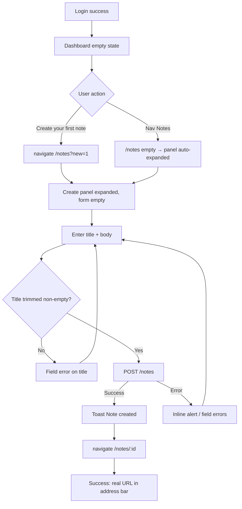
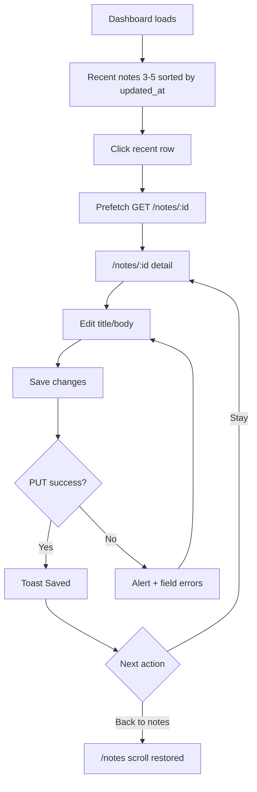
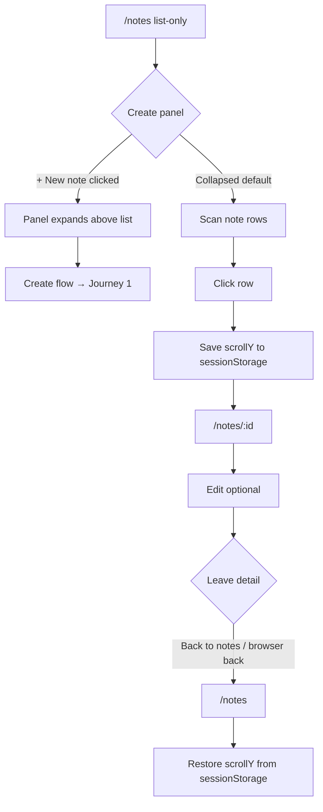
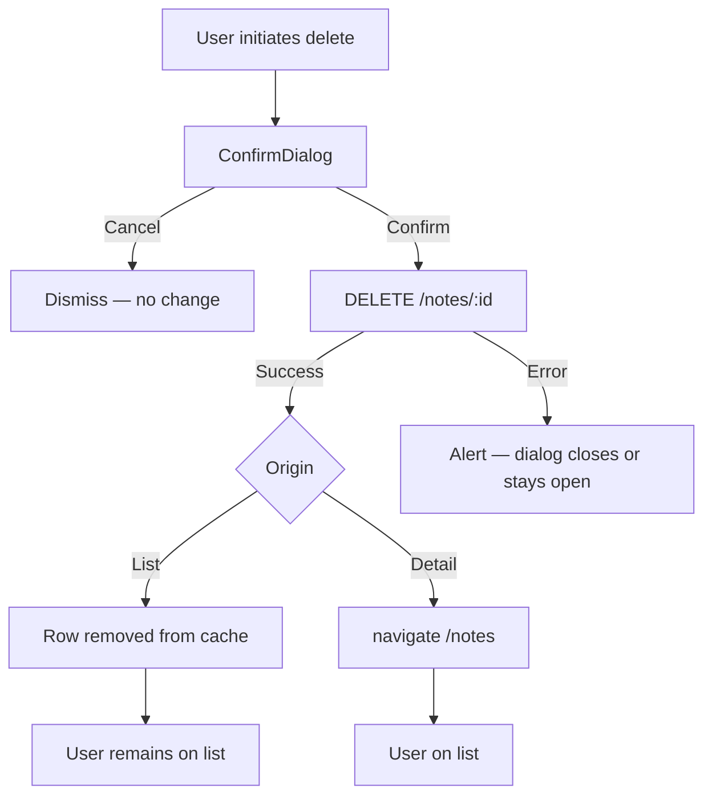

# UX Design Specification bmad-python-fastapi

**Author:** Vitali
**Date:** 2026-06-05

---

## Executive Summary

### Project Vision

bmad-python-fastapi is a learning-oriented notes application demonstrating production-realistic full-stack patterns while remaining small enough to understand end-to-end. The UX scope for this specification covers **Dashboard + Notes** — the two surfaces users interact with most after login.

**Agreed design direction (Variant A): Dashboard as hub, Notes as workspace.**

- **Dashboard** answers: *Where am I? What should I do next? What was I working on?*
- **Notes list** answers: *What do I have? Let me find or create.*
- **Note detail** answers: *Let me read and edit this one note.*

Architecture visibility remains a first-class requirement (URL-driven state, shareable note links, scroll restoration). Visual polish is secondary to **clear page roles and predictable navigation**.

Route map is unchanged from ADR-008 (`/dashboard`, `/notes`, `/notes/:id`, `/settings`). This spec changes **page content, layout, and interaction behavior** within those routes.

### Target Users

**Primary — Learner-developer**

- Reads the codebase to understand SPA routing, server state, and mutations.
- Needs each page to have an obvious, teachable responsibility (hub vs. list vs. detail).
- Requires a single shared sort utility consumed by Dashboard and NotesListPage.
- Tolerates minimal UI chrome; values correct flows and testable hooks.

**Secondary — Demo reviewer**

- Validates the app quickly after login.
- Expects Dashboard to orient them in one glance without feeling like a detour.
- Primary demo path: Login → Dashboard → New note → Detail.

**Tertiary — Solo note-taker**

- Creates and returns to notes over time.
- Expects recent items on Dashboard to reflect actual recent activity.
- When the list is empty, create panel defaults to expanded (no extra click).

All personas are tech-savvy, desktop-first. Mobile is not v1 priority.

### Key Design Challenges

1. **Page role confusion (current state)** — Dashboard acts as a thin redirect layer with dev telemetry (API version); Notes list retains a two-column split from the pre-routing single-page layout. Users cannot intuit what each page is *for*.

2. **Misleading "Latest note"** — Dashboard uses last item by API sort order (`id`), not most recently updated. Label and data disagree.

3. **Duplicate CTAs and version info** — Dashboard shows redundant "New note" / "View all notes" pairs; API version duplicates footer `BuildInfo`.

4. **Split list + create layout** — On `/notes`, browsing and composing compete for equal screen space; clicking a row navigates away, making the right column feel orphaned.

5. **Cross-page create handoff** — Dashboard "New note" opens `/notes` without signaling a fresh form.

6. **Save feedback gap on detail** — Updates show loading state but no success confirmation.

7. **Delete misclick risk on list-only layout** — Inline red Delete links adjacent to row click targets.

8. **Shared note namespace** — Until authz ADR, all users share one note pool; UX must not imply private "my notes" isolation.

### Design Opportunities

1. **Dashboard as genuine home (Variant A)** — Recent notes list (3–5), single primary CTA, remove API version block from home. Optional "Continue editing" link for last opened note.

2. **Notes list as focused browse** — List-only layout with create as a deliberate action (header button → expandable panel above list). Auto-expand when list is empty or when arriving via `?new=1`.

3. **Correct recency semantics** — Sort by `updated_at` desc (fallback `id` desc) via shared `sortNotesForDisplay()`; Dashboard recent and Notes list use identical ordering.

4. **Navigation as UX backbone** — Breadcrumbs on detail; scroll restoration on list return; prefetch on hover preserved.

5. **Query-param create signal** — `/notes?new=1` from Dashboard ensures clean create context; strip query via `replace` after read.

6. **Consistent destructive patterns** — Shared `ConfirmDialog`; delete on list via overflow menu (⋯), not inline red link.

7. **Developer info relocation** — API version from `GET /health` moves to Settings (collapsible "Developer info") — preserves multi-query learning story without cluttering home.

### Agreed UX Direction: Variant A

| Surface | Role | Key changes from current |
|---------|------|--------------------------|
| **Dashboard** | Hub / home after login | Recent notes (3–5); one CTA; tagline under greeting; no API version block; fix recency logic |
| **Notes list** | Browse + create entry | Remove 50/50 split; list-only + expandable create panel above list |
| **Note detail** | Read / edit | Rename "New note" → "Back to notes"; add save/create confirmation toast |
| **Settings** | Profile + dev info | Add collapsible Developer info with API version |

**Explicitly out of scope for this UX pass:** search/sort query params (v2), unsaved-changes warning on detail (v2), authz/ownership UI, mobile-first layout, `/notes/new` route.

### Pre-mortem Hardening (Variant A)

**Failure scenario addressed:** Hub and list-only refactor ships but users bypass Dashboard, recent notes disagree with list order, and create entry points behave inconsistently.

**Preventive decisions:**

| Decision | Rationale |
|----------|-----------|
| Single note sort source (`sortNotesForDisplay()`) | Dashboard recent and Notes list share identical ordering |
| Post-create: redirect to detail + toast | One path, not optional; aligns with shareable URLs |
| `?new=1` with URL cleanup | Dashboard → Notes with fresh form; strip query after read via `replace` |
| API version → Settings (dev section) | Preserves learning story without cluttering home |
| Create panel: expandable above list | Toggle via header; auto-expand when empty or `?new=1` |
| List delete: overflow menu (⋯) | Reduces misclick risk on list-only layout |

**Acceptance signals (pre-launch):**

- [ ] Dashboard recent[0] title matches first row on Notes list (same sort)
- [ ] Dashboard → New note → form empty, URL ends as `/notes`
- [ ] Create → lands on `/notes/:id` with confirmation feedback
- [ ] Learner can find API version in Settings, not on Dashboard home

### Persona Validation (Focus Group)

**Learner-developer:** Expandable create state lives in page-local `useState`; `?new=1` triggers initial expand — document in spec, not URL-persisted.

**Demo reviewer:** Dashboard empty state includes one-line onboarding copy. Hub delivers value in one screen.

**Solo note-taker:** Recent block (3–5 items) sufficient for v1. Unsaved-changes warning on detail navigation deferred to v2.

**Additional decisions:**

| Decision | Source persona |
|----------|----------------|
| `sortNotesForDisplay()` shared util | Learner-dev |
| Empty list → create panel expanded by default | Solo note-taker |
| Dashboard tagline under greeting | Demo reviewer |
| Optional "Continue editing" (last note id in sessionStorage) | Demo reviewer / Note-taker |

---

## Core User Experience

### Defining Experience

The core loop for bmad-python-fastapi is **find → open → edit → save** (with create and delete as branches). Users spend most active time on **Note detail** (`/notes/:id`); Dashboard and Notes list exist to **orient and route** into that loop quickly.

| Layer | Route | Core job |
|-------|-------|----------|
| Hub | `/dashboard` | "What was I doing? What next?" |
| Browse | `/notes` | "Show me everything; let me create when ready" |
| Work | `/notes/:id` | "This one note — read and edit" |

The product is not notes-at-scale (no search, tags, or folders in v1). Success means **zero confusion about which page owns which action** — a teaching goal as much as a user goal.

### Platform Strategy

| Dimension | Decision |
|-----------|----------|
| Platform | Web SPA (React), desktop-first |
| Input | Mouse + keyboard; no touch-specific patterns in v1 |
| Viewport | Single-column content, max-width layout (`AppLayout`); list-only Notes works from ~768px up |
| Connectivity | Online-only; TanStack Query assumes live API |
| Auth | JWT in sessionStorage; protected routes via `ProtectedRoute` |
| Deploy | Same-origin proxy (dev + prod); no offline mode |

Mobile is supported passively (responsive stack) but not optimized — acceptable for learning scope.

### Effortless Interactions

These interactions must require **no conscious thought**:

1. **Return to work after login** — Dashboard shows recent notes; one click → detail.
2. **Start a new note from home** — Single CTA → `/notes?new=1` → expanded empty form → URL cleans to `/notes`.
3. **Open a note from list** — Row click → detail; prefetch on hover makes load feel instant.
4. **Return to list without losing place** — Browser back or "Back to notes"; scroll position restored.
5. **Know save succeeded** — Toast on create and update; no silent failures.
6. **Share or bookmark a note** — URL `/notes/:id` is always valid when authenticated.

**Automatic (no user action):** Query cache invalidation after mutations; token attach on API calls; redirect on 401.

### Critical Success Moments

| Moment | User feeling | Failure if broken |
|--------|--------------|-------------------|
| **First login → Dashboard** | "I see my stuff" (or clear empty CTA) | Blank hub, duplicate buttons, dev noise |
| **First note created** | "It exists at a real URL" | Stuck on list, no feedback, wrong redirect |
| **Return after days away** | Recent notes match memory | Wrong sort, misleading "latest" |
| **Edit and save** | "Saved — I can leave" | Silent save, ambiguous button labels |
| **Delete** | "I meant to do that" | Misclick delete on list row |
| **Demo in 30 seconds** | Login → create → edit flows | Extra clicks through meaningless hub |

**Make-or-break flows:** Login → Dashboard → New note → Create → Detail → Save; List → Detail → Back (scroll); Dashboard recent → Detail.

### Experience Principles

1. **One page, one job** — Dashboard orients; list browses; detail edits. No page splits attention 50/50.
2. **URL is truth** — Route reflects entity state; create uses query signal only transiently (`?new=1`).
3. **Same data, same order** — Dashboard recent and Notes list share `sortNotesForDisplay()`; never show conflicting recency.
4. **Confirm destructive, automate mundane** — Delete always confirms; save/token/cache happen without ceremony.
5. **Feedback closes the loop** — Every mutation ends with visible outcome (toast, navigation, or inline error).
6. **Teach through structure** — Layout choices should be readable in code (`pages/`, shared utils, overflow menu pattern).

---

## Desired Emotional Response

### Primary Emotional Goals

Users should feel **oriented and in control** — never wondering which page they are on or what happens next. Secondary feelings: **calm focus** while editing, **quiet confidence** after save/delete, and **competence** when demoing or reading the codebase (learner-dev persona).

This is not a delight-first product. Emotional success = **zero friction confusion** — the user thinks about their note content, not the UI mechanics.

### Emotional Journey Mapping

| Stage | Desired feeling | UX support |
|-------|-----------------|------------|
| **First login → Dashboard** | Welcomed, oriented | Greeting + tagline + recent or clear empty CTA |
| **Browse Notes list** | Calm scan, not overwhelmed | List-only; create hidden until requested |
| **Create note** | Purposeful, not rushed | Expanded panel, empty fields, single submit path |
| **Land on detail after create** | Accomplishment | Toast "Note created" + real URL in address bar |
| **Edit and save** | Confidence, closure | Toast "Saved"; no silent state |
| **Return after absence** | Continuity | Recent on Dashboard matches memory; optional "Continue editing" |
| **Delete** | Deliberate, not anxious | Confirm dialog; overflow menu reduces accident fear |
| **Error (load/save/network)** | Informed, not abandoned | Inline alert + retry path where applicable |
| **Returning daily** | Familiarity | Stable nav, predictable page roles |

### Micro-Emotions

| Target | Avoid |
|--------|-------|
| **Confidence** (I know where I am) | Confusion (split layout, wrong "latest") |
| **Trust** (save worked, delete was intentional) | Skepticism (silent save, misclick delete) |
| **Focus** (one task per page) | Anxiety (competing panels, dev noise on home) |
| **Accomplishment** (note exists at URL) | Frustration (dead-end after create, lost scroll) |
| **Efficiency** (few clicks to core loop) | Impatience (hub that feels like extra step) |

**Critical micro-emotion:** *Confidence after mutation* — create, update, and delete must each close with visible feedback.

### Design Implications

| Emotion | UX choice |
|---------|-----------|
| Oriented | One page = one job; breadcrumbs on detail only |
| Calm | Remove 50/50 split; collapse create by default when notes exist |
| Confident | Toasts on save/create; confirm on delete |
| Trust | Same sort on Dashboard and list; honest labels ("Back to notes") |
| Continuity | Scroll restoration; recent block; optional continue-editing link |
| Focus (learner) | Dev info in Settings, not Dashboard home |
| Deliberate delete | Overflow menu (⋯), not inline red link |

**Anti-patterns that create negative emotion:**
- Misleading "Latest note" label
- Duplicate CTAs to the same destination
- "New note" button that navigates back to list
- API version block competing with user content on home

### Emotional Design Principles

1. **Clarity over charm** — Prefer obvious structure to animation or visual flair.
2. **Close every loop** — No mutation ends in ambiguity; always toast, navigate, or error.
3. **Respect attention** — Show create UI only when the user asks for it (except empty-state default expand).
4. **Honest labels** — UI copy matches behavior (recent = by updated_at; back = back).
5. **Errors are calm** — Red alert boxes with plain language; no blame, no jargon.
6. **Hub earns its click** — Dashboard must feel useful in one screen, not a mandatory detour.

---

## UX Pattern Analysis & Inspiration

### Inspiring Products Analysis

**Apple Notes (list → detail)**
- Solves: quick capture and return to a specific note.
- Navigation: sidebar/list selects note; detail is full-width editor — no split-view competition.
- Transferable: list-only browse; detail owns editing; breadcrumbs optional (we use them on detail only).

**Bear / Simplenote (minimal notes apps)**
- Solves: focus on title + body without feature noise.
- Interaction: create is a deliberate action; list is scannable rows with preview text.
- Transferable: truncated preview in list rows; empty state invites first note; no dev metadata on home.

**GitHub Dashboard (hub / recents)**
- Solves: "what happened recently?" after login.
- Navigation: home shows activity feed + quick links; work happens on entity pages.
- Transferable: recent notes block (3–5); single primary CTA; entity pages (`/notes/:id`) for deep work.
- Avoid: GitHub's density — our hub stays minimal.

**Linear (clean app shell)**
- Solves: orientation without clutter.
- Visual: clear header nav, one primary action per view, subtle status feedback.
- Transferable: AppLayout nav; one primary button per page; toast for mutation feedback.
- Avoid: Linear's keyboard-first power-user patterns — out of scope for v1.

### Transferable UX Patterns

**Navigation**

| Pattern | Source | Application |
|---------|--------|-------------|
| Hub → entity page | GitHub, Linear | Dashboard recent → `/notes/:id` |
| List → detail route | Apple Notes | `/notes` row click → detail URL |
| Breadcrumbs on deep page only | Common SaaS | `Notes > {title}` on detail only |
| Scroll restoration | Feed apps | `sessionStorage` on list return |

**Interaction**

| Pattern | Source | Application |
|---------|--------|-------------|
| Expandable create panel | Gmail compose | Header "New note" toggles panel above list |
| Overflow menu for destructive | iOS Mail, Linear | ⋯ → Delete on list rows |
| Transient query signal | Common SPA | `?new=1` → expand + reset, then strip URL |
| Prefetch on hover | GitHub, Linear | `prefetchNote` on list row hover |
| Toast on mutation | Universal | "Note created" / "Saved" |

**Visual**

| Pattern | Source | Application |
|---------|--------|-------------|
| Card rows with preview | Bear, Apple Notes | `NoteList` title + body truncate + updated_at |
| Single primary CTA | Linear | One indigo button per page context |
| Collapsible dev section | VS Code settings | API version in Settings "Developer info" |
| Footer version only | Common SaaS | `BuildInfo` — no duplicate on Dashboard |

### Anti-Patterns to Avoid

| Anti-pattern | Seen in | Why avoid |
|--------------|---------|-----------|
| Master-detail split with route change | Legacy SPAs | Right panel orphaned when row navigates away |
| Mislabeled recency | Bad dashboards | "Latest" ≠ last by id; destroys trust |
| Duplicate CTAs | CRUD demos | "New" + "View all" to same place — noise |
| Inline destructive next to primary click | Old note apps | Misclick delete — use overflow |
| Dev telemetry on user home | Internal tools | API version on Dashboard — breaks focus |
| Silent save | Some editors | User leaves thinking they saved — use toast |
| Feature-rich empty hub | Notion | Overwhelms learning scope — keep hub to 3–5 recents + 1 CTA |

### Design Inspiration Strategy

**Adopt directly**
- Apple Notes list → detail separation (no 50/50 on list page).
- GitHub-style recent block on Dashboard.
- Toast feedback on mutations.
- Overflow menu delete on list.

**Adapt (simplify for learning project)**
- Notion-style create → expandable panel only (no blocks, no slash commands).
- Linear nav → three links + logout (no command palette).
- GitHub feed → static recent list (no activity stream API).

**Avoid**
- Notion's infinite nesting and databases — scope creep.
- Bear's tags and markdown — no backend for v1.
- Full master-detail SPA — replaced by routed pages per ADR-008.
- Dashboard as analytics wall — count cards alone don't orient.

**Unique to bmad-python-fastapi**
- Page roles teach SPA architecture (hub / browse / work).
- Developer info in Settings preserves learning story without home clutter.
- Shared `sortNotesForDisplay()` — pattern worth documenting for learner-dev.

---

## Design System Foundation

### 1.1 Design System Choice

**Tailwind CSS 4 utility-first styling with project-local React components** — no third-party component library (MUI, Chakra, shadcn/ui) for v1.

Existing components (`NoteList`, `NoteForm`, `ConfirmDialog`, `AppNav`, `Breadcrumbs`, `BuildInfo`) remain the design system surface. Variant A adds:

| New / extended component | Purpose |
|--------------------------|---------|
| `Toast` (or inline toast region) | Create/save feedback |
| `NoteListItem` + overflow menu | List row with ⋯ delete |
| `RecentNotesList` | Dashboard recent block |
| `ExpandableCreatePanel` | Collapsible create on Notes list |
| `DeveloperInfo` (Settings) | Collapsible API version |

### Rationale for Selection

1. **Brownfield alignment** — `project-context.md` mandates Tailwind utilities only; no Vite template CSS.
2. **Learning goal** — Learner-dev reads JSX + Tailwind directly; no abstraction through a component library API.
3. **Speed vs. scope** — Variant A is layout/behavior refactor, not a visual rebrand; utilities are sufficient.
4. **Bundle size** — No extra dependency for a notes demo on Render preview.
5. **Consistency already emerging** — indigo primary, gray neutrals, red destructive, rounded-md buttons — document as informal tokens.

### Implementation Approach

**Styling:** Tailwind utility classes in components; no new CSS files unless toast animation requires a single `@keyframes` in `index.css`.

**Informal design tokens (existing conventions):**

| Token | Tailwind usage |
|-------|----------------|
| Primary action | `bg-indigo-600 hover:bg-indigo-700` |
| Secondary action | `border border-gray-300 hover:bg-gray-50` |
| Destructive text | `text-red-600 hover:text-red-800` |
| Surface / card | `rounded-lg border border-gray-200 bg-white p-4` |
| Page background | `bg-gray-50` (AppLayout) |
| Error alert | `border-red-200 bg-red-50 text-red-800` |
| Muted text | `text-gray-500` / `text-gray-400` |
| Focus ring | `focus:border-indigo-500 focus:ring-indigo-500` |

**Accessibility baseline (v1):**
- `role="alert"` on errors (already present).
- `aria-label` on overflow menu buttons.
- Form labels linked via `htmlFor` (already in `NoteForm`).
- Toast: `role="status"` + `aria-live="polite"`.

**No design-token file in v1** — tokens stay implicit in Tailwind classes; revisit if theme/dark mode requested later.

### Customization Strategy

**Keep as-is**
- `AppLayout` shell, nav active state (`bg-indigo-100 text-indigo-700`).
- `ConfirmDialog` modal pattern.
- `NoteForm` field layout.

**Extend for Variant A**
- Extract list row into `NoteListItem` with overflow menu — single place for row layout + delete affordance.
- Add minimal `Toast` — fixed bottom or top-right, auto-dismiss ~3s; custom lightweight component (no new dependency by default).
- Dashboard recent rows reuse same row styling as `NoteList` for visual consistency.
- Settings `DeveloperInfo` — `
`/`
` or button-toggle collapse; no accordion library.

**Explicitly not adding**
- Dark mode, theme switcher, CSS variables layer.
- Icon library (optional: inline SVG for ⋯ menu only).
- Typography scale beyond Tailwind defaults (`text-2xl` h1, `text-sm` body).

**Component ownership rule (from project-context):** Presentational components — props in, callbacks out; pages own state.

---

## 2. Core User Experience

### 2.1 Defining Experience

**The defining experience:** *Pick up where you left off — open a note, edit, trust it's saved.*

Users describe the app as: "I log in, see my recent notes, click one, edit, save — done." The product succeeds when **page roles disappear from consciousness** — users think about note content, not navigation.

Secondary defining loop: **Create → land on real URL** — "I made a note and I can bookmark `/notes/42`."

### 2.2 User Mental Model

Users bring a **folderless notes app** mental model (Apple Notes, Bear, not Notion):

| Expectation | Our response |
|-------------|--------------|
| "Home shows my recent stuff" | Dashboard recent block |
| "List shows all my notes" | `/notes` browse-only |
| "Click a note to open it" | Navigate to `/notes/:id` |
| "One note = one page" | Detail owns edit; no split view |
| "Save means saved" | Toast feedback |
| "Delete asks me first" | ConfirmDialog |
| "Back returns to where I was" | Scroll restoration on list |

**Confusion points (current → fixed):**
- "Why is there a form next to the list when I click away?" → list-only
- "Why does Latest note show the wrong one?" → sort by updated_at
- "Did Save work?" → toast

### 2.3 Success Criteria

| Criterion | Measure |
|-----------|---------|
| **Orientation in 3 seconds** | After login, user identifies recent notes or empty CTA without reading docs |
| **One click to core loop** | Dashboard recent → detail in 1 click |
| **Create clarity** | New note from Dashboard arrives at empty expanded form |
| **Save trust** | 100% of successful mutations show visible feedback within 500ms |
| **URL honesty** | `/notes/:id` loads that note; back returns to list scroll |
| **No misclick delete** | Delete on list requires overflow + confirm |
| **Demo path ≤ 4 clicks** | Login → Dashboard → New note → Create → Detail |

### 2.4 Novel UX Patterns

**Mostly established patterns** — list/detail, hub recents, toast feedback, confirm delete. Users need no education.

**Novel twist (teaching purpose):**
- **Transient `?new=1` create signal** — query param as one-shot intent, stripped after read. Familiar to devs, invisible to end users.
- **Page-role architecture** — hub / browse / work as separate routes. The "novelty" is for learner-dev reading code, not user-facing innovation.

**No novel interaction requiring onboarding** — avoid command palette, gestures, or new metaphors in v1.

### 2.5 Experience Mechanics

#### Flow A: Return and edit (primary)

| Phase | User action | System response |
|-------|-------------|-----------------|
| **Initiation** | Login | Redirect `/dashboard` |
| | Scan recent list | Show 3–5 notes sorted by `updated_at` desc |
| | Click recent row | Prefetch; navigate `/notes/:id` |
| **Interaction** | Edit title/body | Local form state; fields enabled |
| | Click "Save changes" | `PUT /notes/:id`; button shows "Saving…" |
| **Feedback** | Save succeeds | Toast "Saved"; optimistic cache update |
| | Save fails | Inline alert + field errors if 422 |
| **Completion** | User leaves | Optional: stay on detail or "Back to notes" → list with scroll |

#### Flow B: Create from home

| Phase | User action | System response |
|-------|-------------|-----------------|
| **Initiation** | Click "New note" on Dashboard | `navigate('/notes?new=1')` |
| **Interaction** | Land on Notes | Expand create panel; reset form; `replace` URL → `/notes` |
| | Enter title + body; submit | `POST /notes` |
| **Feedback** | Success | Toast "Note created"; navigate `/notes/:id` |
| **Completion** | User on detail URL | Shareable link; recent updates on next Dashboard visit |

#### Flow C: Browse list → open

| Phase | User action | System response |
|-------|-------------|-----------------|
| **Initiation** | Nav → Notes | List-only; create collapsed (unless empty list) |
| | Click row | Save scroll Y; navigate `/notes/:id` |
| **Interaction** | Edit on detail | Flow A interaction |
| **Completion** | "Back to notes" or browser back | Restore scroll Y on list |

#### Flow D: Delete

| Phase | User action | System response |
|-------|-------------|-----------------|
| **Initiation** | ⋯ → Delete (list) or Delete (detail) | Open ConfirmDialog |
| **Interaction** | Confirm | `DELETE /notes/:id` |
| **Feedback** | Success | Close dialog; list: row gone; detail: navigate `/notes` |
| **Completion** | — | Dialog close sufficient in v1 |

---

## Visual Design Foundation

### Color System

**Approach:** Retain existing Tailwind palette — no rebrand for Variant A. Colors support emotional goals: calm (neutrals), confident action (indigo), calm errors (red-50/800), not aggressive destructive fills.

| Role | Tailwind | Usage |
|------|----------|-------|
| **Primary** | `indigo-600` / `indigo-700` hover | CTAs: New note, Create, Save |
| **Primary subtle** | `indigo-100` / `indigo-700` | Active nav link background/text |
| **Neutral text** | `gray-900` (headings), `gray-700` (labels), `gray-500` (secondary), `gray-400` (timestamps) |
| **Surfaces** | `white` cards on `gray-50` page bg | Dashboard cards, list border, AppLayout |
| **Borders** | `gray-200` / `gray-300` | Cards, inputs, dividers |
| **Destructive** | `red-600` text (not filled buttons) | Delete in overflow/detail; ConfirmDialog confirm |
| **Error** | `red-50` bg, `red-200` border, `red-800` text | Inline alerts |
| **Links** | `indigo-600` hover `indigo-800` | Recent note links, back links |

**No semantic color expansion in v1** — toast uses neutral/dark bg with white text; keep palette minimal.

**Contrast:** Body text `gray-900` on `white` and `gray-50` meets WCAG AA for normal text. Primary buttons white on `indigo-600` — Tailwind indigo-600 passes for button text.

### Typography System

**Approach:** System font stack via Tailwind default (`font-sans`). No custom web fonts.

| Element | Classes | Usage |
|---------|---------|-------|
| Page title | `text-2xl font-semibold text-gray-900` | Dashboard greeting, Notes h1, Edit note h1 |
| Section title | `text-lg font-medium text-gray-900` | "All notes", "Recent notes" |
| Body / form | `text-sm` | Inputs, list previews, buttons |
| Caption | `text-xs text-gray-400` | Updated timestamps |
| Tagline | `text-sm text-gray-500` | Dashboard subtitle |
| Button label | `text-sm font-medium` | All buttons |

### Spacing & Layout Foundation

**Approach:** Airy but efficient — Tailwind 4px scale.

| Token | Value | Usage |
|-------|-------|-------|
| Page padding | `px-4 py-8` | Main content area (AppLayout) |
| Max content width | `max-w-5xl mx-auto` | Centered column |
| Section gap | `mt-6`, `gap-8` | Between page sections |
| Card padding | `p-4` / `p-6` | Dashboard cards, empty states |
| List row padding | `p-3` | NoteListItem |
| Form field gap | `space-y-4` | NoteForm |
| Button gap | `gap-2` / `gap-3` | Button groups |

**Layout shift (Variant A):** Notes list single column full width; Dashboard vertical stack; create panel full-width above list with `mb-6`.

### Accessibility Considerations

| Area | Requirement |
|------|-------------|
| **Focus** | Visible focus ring on inputs; keyboard nav through list rows as buttons |
| **Alerts** | `role="alert"` on errors; toast `role="status"` + `aria-live="polite"` |
| **Forms** | Labels via `htmlFor`; `FieldError` linked to inputs |
| **Delete** | `aria-label` on overflow trigger |
| **Color** | Errors include text, not color alone |

---

## Design Direction Decision

### Design Directions Explored

Three layout directions evaluated (see `ux-design-directions.html`):

| ID | Name | Hub | Notes create | Verdict |
|----|------|-----|--------------|---------|
| **D1** | Expand Panel | Recent list + single CTA | Collapsible panel above list | **Selected** |
| **D2** | Slide-over Create | Same as D1 | Right slide-over panel | Rejected — extra complexity |
| **D3** | Compact Hub | Greeting + CTA only, no recent | N/A | Rejected — weak orientation |

Visual foundation unchanged: indigo + gray Tailwind, system fonts, `max-w-5xl` shell.

**Stakeholder selection:** D1 (Expand Panel) confirmed by Vitali.

### Chosen Direction

**Direction 1 — Expand Panel (Variant A)**

- **Dashboard:** Greeting + tagline → Recent notes (3–5) → single "+ New note" CTA → optional "Continue editing"
- **Notes list:** Header with "+ New note" → expandable create panel (above list) → full-width note list with overflow delete
- **Note detail:** Breadcrumbs → edit form → "Back to notes" + toast feedback
- **Settings:** Developer info collapsible (API version)

### Design Rationale

1. Aligns with agreed Variant A and all prior workflow steps.
2. D1 uses established patterns (Apple Notes list/detail + GitHub recents) without slide-over learning curve.
3. Expand panel keeps create in document flow — easier to implement and test than D2 overlay.
4. Recent block on Dashboard delivers hub value D3 lacks.
5. Single-column Notes list removes split-view confusion from current implementation.

### Implementation Approach

1. Refactor `DashboardPage` — replace stat cards with `RecentNotesList`; remove API version block.
2. Refactor `NotesListPage` — remove `lg:grid-cols-2`; add `ExpandableCreatePanel` + `?new=1` handling.
3. Extract `NoteListItem` with overflow menu from `NoteList`.
4. Add `Toast` component; wire create/update mutations.
5. Update `NoteDetailPage` — "Back to notes" label; optional `sessionStorage` last-note for Dashboard.
6. Add `DeveloperInfo` to `SettingsPage`.
7. Add `sortNotesForDisplay()` shared util.
8. Update Playwright smoke for new layout selectors.

**Reference mockup:** `_bmad-output/planning-artifacts/ux-design-directions.html`

---

## User Journey Flows

### Journey 1: First-time user — create first note

**Persona:** Demo reviewer or new learner-dev after seed login.  
**Goal:** Create first note and land on a shareable URL.  
**Entry:** `/login` → success → `/dashboard` (empty state).

### Journey 2: Return and edit (primary loop)

**Persona:** Solo note-taker returning after absence.  
**Goal:** Open recent note, edit, trust save.  
**Entry:** `/dashboard` with existing notes.

### Journey 3: Browse list → open → return

**Persona:** Any authenticated user.  
**Goal:** Find note in full list, open, return without losing scroll position.  
**Entry:** Nav → `/notes`.

### Journey 4: Delete note

**Entry:** List overflow ⋯ or detail Delete button.

### Journey 5: Error recovery

**Triggers:** Network failure, 401, 404 note, 422 validation.

| Error | User sees | Recovery |
|-------|-----------|----------|
| 401 on API | Token cleared → `/login` | Re-login |
| Note list load fail | Alert on `/notes` | Retry via refresh |
| Note detail 404 | Alert + Back to notes | Navigate list |
| Save 422 | Field errors on title/body | Fix and resubmit |
| Session check fail | ProtectedRoute error shell | Retry / Sign out |

### Journey Patterns

**Navigation:** Hub → entity (`/dashboard` → `/notes/:id`); list → detail → list with scroll restore; transient `?new=1` then clean URL.

**Decision:** Single confirm gate for all deletes; title trim validation before submit.

**Feedback:** Toast on create/update success; `role="alert"` on errors; loading labels on buttons ("Saving…", "Deleting…").

**Progressive disclosure:** Create panel collapsed when notes exist; expanded when empty or `?new=1`; Developer info collapsed in Settings.

### Flow Optimization Principles

1. **Minimize clicks to core loop** — Dashboard recent → detail in 1 click.
2. **One primary CTA per page** — Dashboard: New note; Notes header: toggle create.
3. **Never silent mutations** — Toast or navigation confirms outcome.
4. **Preserve context on back** — Scroll restoration on list return.
5. **Fail visibly** — Errors inline; no empty broken states without message.
6. **Same sort everywhere** — `sortNotesForDisplay()` for Dashboard recent and Notes list.

---

## Component Strategy

### Design System Components

**Foundation (existing — reuse as-is):**

| Component | Location | Role in D1 |
|-----------|----------|------------|
| `AppLayout` | `layouts/` | Shell: nav + outlet + footer |
| `AppNav` | `components/` | Dashboard / Notes / Settings + logout |
| `ProtectedRoute` | `components/` | Auth guard |
| `NoteForm` | `components/` | Title + body fields, submit |
| `ConfirmDialog` | `components/` | Delete confirmation |
| `Breadcrumbs` | `components/` | Detail: Notes > {title} |
| `BuildInfo` | `components/` | Footer version |
| `FieldError` | `components/` | Validation messages |
| `LoginForm` | `components/` | Public login |

**Utility (new file, not a component):**

| Module | Location | Role |
|--------|----------|------|
| `sortNotesForDisplay()` | `frontend/src/utils/notesSort.ts` | Shared sort for Dashboard + list |

### Custom Components

#### RecentNotesList

**Purpose:** Dashboard hub — show 3–5 recent notes with links to detail.  
**Content:** Note title, relative updated_at, optional body preview (truncated).  
**Actions:** Click row → navigate `/notes/:id`; prefetch on hover.  
**States:** loading, empty (hidden — empty state handled by page), populated, error (page-level).  
**Accessibility:** Each row is a button or link with descriptive text.

#### ExpandableCreatePanel

**Purpose:** Collapsible create form above Notes list (D1).  
**Content:** Wraps `NoteForm` with section heading "New note".  
**Actions:** Toggle expand/collapse via header "+ New note"; Cancel collapses + clears.  
**States:** collapsed, expanded, saving (form disabled), error (inline).  
**Props:** `expanded`, `onExpandedChange`, form state from parent page.  
**Triggers auto-expand:** empty note list; `?new=1` on mount.

#### NoteListItem

**Purpose:** Single row in Notes list with overflow delete.  
**Anatomy:** clickable title area, preview, updated_at, ⋯ menu.  
**Actions:** Row click → onSelect; ⋯ → Delete → onDelete; hover → onPrefetch.  
**States:** default, hover, focus, menu open.  
**Accessibility:** Row button for open; `aria-label="Actions for {title}"` on ⋯.

#### Toast

**Purpose:** Mutation feedback ("Note created", "Saved").  
**Content:** Short message string.  
**States:** visible (auto-dismiss ~3s), hidden.  
**Implementation:** Page-level state; `role="status"` `aria-live="polite"`.  
**Position:** Fixed bottom-right; dark bg, white text.

#### DeveloperInfo

**Purpose:** Settings collapsible — API version from `useHealthQuery`.  
**Content:** Label "Developer info", version string.  
**States:** collapsed (default), expanded, loading, error.  
**Implementation:** Native `
`/`
` preferred.

### Component Implementation Strategy

1. **Pages own state** — `NotesListPage` holds create panel expanded + form state.
2. **Compose, don't duplicate** — `ExpandableCreatePanel` wraps `NoteForm`.
3. **Shared row styling** — `NoteListItem` used by `NoteList` and `RecentNotesList`.
4. **No new npm deps** by default — custom `Toast`.
5. **`data-testid`** — preserve existing; add `recent-notes`, `create-panel`, `toast`.

### Implementation Roadmap

**Phase 1 — Core (Journey 1 & 2):** sort util, RecentNotesList, ExpandableCreatePanel, Toast.  
**Phase 2 — List safety (Journey 3 & 4):** NoteListItem overflow, Back to notes, `?new=1`.  
**Phase 3 — Polish (Journey 5):** DeveloperInfo, Continue editing, E2E updates.

---

## UX Consistency Patterns

### Button Hierarchy

| Level | Style | Usage | Max per view |
|-------|-------|-------|--------------|
| **Primary** | `bg-indigo-600` filled | One main action: New note, Create note, Save changes | 1 per page section |
| **Secondary** | `border border-gray-300` | Cancel, Back to notes | Unlimited |
| **Destructive** | `text-red-600` text only | Delete — never filled red button | Requires ConfirmDialog |
| **Ghost / nav** | NavLink active state | Dashboard, Notes, Settings | — |

**Rules:** One filled indigo primary per section; destructive always confirms; Dashboard and Notes each own one primary CTA.

### Feedback Patterns

| Type | Component | When | Duration |
|------|-----------|------|----------|
| **Success** | Toast | Create, update success | Auto-dismiss ~3s |
| **Error (global)** | Alert banner `role="alert"` | Load/mutation fail | Until retry |
| **Error (field)** | `FieldError` | Validation | Until fixed |
| **Loading** | Button label | Saving…, Deleting… | While pending |
| **Confirm destructive** | `ConfirmDialog` | All deletes | Until user acts |

### Form Patterns

- Trim title before validate; required title; maxLength 200/10_000.
- Create only in ExpandableCreatePanel; edit only on detail.
- Disable inputs while mutation pending.

### Navigation Patterns

Post-login → `/dashboard`; recent/row → `/notes/:id`; back restores scroll; create via `?new=1`; post-create → detail; post-delete detail → list.

### Additional Patterns

**Empty states:** Dashboard CTA when no notes; Notes auto-expand create when empty.  
**Loading:** Text-only spinners in v1 (no skeleton).  
**Modals:** ConfirmDialog only — create is inline panel (D1).  
**Overflow:** ⋯ → Delete → ConfirmDialog.  
**Meta info:** Version in footer; API version in Settings DeveloperInfo only.

---

## Responsive Design & Accessibility

### Responsive Strategy

**Desktop-first (primary):** Target viewport ≥1024px — learner-dev local dev, demo on preview. `max-w-5xl` centered column; list and create panel stack vertically (D1 removes side-by-side split).

| Device | Strategy |
|--------|----------|
| **Desktop (1024px+)** | Full experience: hub recent, list-only, expand panel above list |
| **Tablet (768–1023px)** | Same single-column stack; touch-friendly tap targets |
| **Mobile (<768px)** | Passive support — nav wraps; list rows full width; no hamburger in v1 |

**Not in v1:** Bottom nav, mobile-specific layouts, swipe gestures, offline PWA.

### Breakpoint Strategy

Tailwind defaults; D1 intentionally removes `lg:grid-cols-2`. Desktop-first CSS; mobile degrades via stack layout.

### Accessibility Strategy

**Target: WCAG 2.1 Level AA where practical.**

| Requirement | Implementation |
|-------------|----------------|
| Color contrast | gray-900 on white; indigo buttons with white text |
| Keyboard | Tab through nav, list rows, forms, dialogs |
| Focus visible | `focus:ring-indigo-500` on inputs |
| Screen readers | Semantic headings; labels; `role="alert"` / `aria-live` |
| Touch targets | Buttons `py-2 px-4`; full-width list row click area |

**Deferred v2:** Skip links, unsaved-changes warning, high contrast theme.

### Testing Strategy

Manual resize 320px–1280px; Playwright smoke; optional axe/Lighthouse; keyboard-only pass before release.

### Implementation Guidelines

Prefer flex/stack over grid; list rows as `<button>`; Toast via `aria-live="polite"`; `
` for DeveloperInfo.

---

## Appendix: Next Steps for Implementation

1. **ADR-009** — Frontend Dashboard & Notes UX v2 (references this spec; supersedes partial ADR-008 UI decisions).
2. **Implementation spec** — `spec-adr-009-dashboard-notes-ux-v2.md` with phases from Component Strategy roadmap.
3. **Development** — `bmad-dev-story` or `bmad-quick-dev` with this spec as input.
4. **CHANGELOG** — PATCH bump when UX refactor ships (no API contract break).

**Reference assets:**
- Design directions: `_bmad-output/planning-artifacts/ux-design-directions.html`
- UX specification: `_bmad-output/planning-artifacts/ux-design-specification.md`

