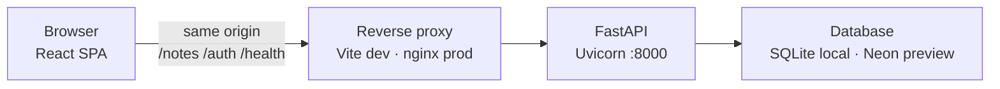
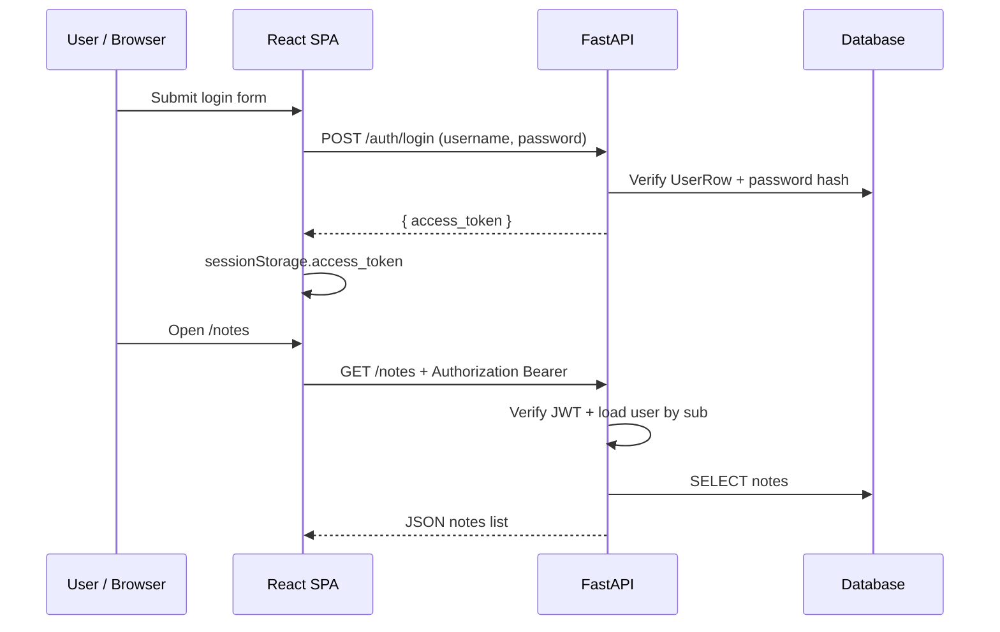
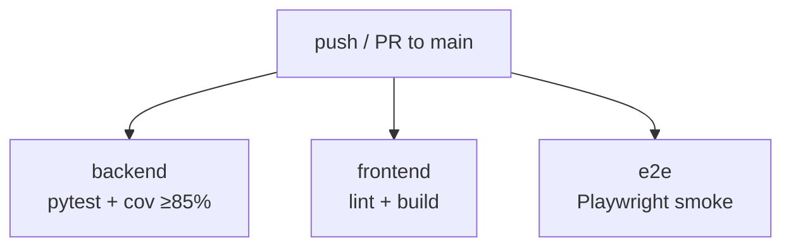

# Architecture overview — Notes API

High-level system design for portfolio reviewers and contributors. Behavior is unchanged from the implementation — this is a **map**, not a spec.

**Related decisions:** [ADR-003](../_bmad-output/planning-artifacts/adr/adr-003-stateless-jwt-authentication.md) (auth), [ADR-004](../_bmad-output/planning-artifacts/adr/adr-004-ci-cd-and-preview-deployment.md) (deploy), [ADR-008](../_bmad-output/planning-artifacts/adr/adr-008-frontend-routing-v1.md) (routing), [ADR-011](../_bmad-output/planning-artifacts/adr/adr-011-visible-quality-phase1.md) (UI quality).

---

## System overview

Three tiers: **browser SPA** → **reverse proxy** → **FastAPI API** → **database**.



### How each environment routes traffic

| Mode | Proxy layer | Static UI | API |
|------|-------------|-----------|-----|
| **Local dev** | Vite (`127.0.0.1:5173`) forwards `/notes`, `/auth`, `/health` | Hot-reload React | Uvicorn on `:8000` |
| **Docker / Render preview** | nginx in container | `frontend/dist/` | Uvicorn on `127.0.0.1:8000` behind nginx |

The browser always talks to **one origin**. No cross-origin API calls — see [security.md § Same-origin & CORS](security.md#5-same-origin--cors).

**nginx template:** [`deploy/nginx.conf.template`](../deploy/nginx.conf.template) — proxies `/notes`, `/auth`, `/health`, `/docs`, OpenAPI paths; `try_files` for SPA routes.

---

## Authentication flow (simplified)

Stateless JWT — login once, send Bearer token on protected routes.



**Details:** token TTL, 401 handling, inactive users — [ADR-003](../_bmad-output/planning-artifacts/adr/adr-003-stateless-jwt-authentication.md) and [security.md](security.md).

**Frontend routes (v1):** `/login` (public) · `/dashboard`, `/notes`, `/notes/:id`, `/settings` (protected) — [ADR-008](../_bmad-output/planning-artifacts/adr/adr-008-frontend-routing-v1.md).

---

## CI pipeline

Every push and PR to `main` runs three parallel jobs ([`.github/workflows/ci.yml`](../.github/workflows/ci.yml)):



| Job | What it proves |
|-----|----------------|
| `backend` | API correctness, migrations, auth, **≥85% line coverage** on `app/` |
| `frontend` | TypeScript lint, production Vite build |
| `e2e` | Login flow, version footer, critical path smoke, axe a11y (`a11y.spec.ts` via `test:e2e`) |

No repository secrets required for CI. Local axe subset: `npm run test:a11y`. Coverage policy: [ADR-010](../_bmad-output/planning-artifacts/adr/adr-010-test-coverage-and-quality-policy.md).

---

## Backend layout (concise)

```
app/
  main.py           # FastAPI app, router mount, OpenAPI version
  routers/          # notes.py, auth.py — thin HTTP layer
  auth/             # JWT config, security, deps, user lookup
  store.py          # Notes repository (SQLAlchemy)
  database.py       # Engine, get_db, production URL guard
alembic/versions/   # Schema migrations (001 → 003)
```

## Frontend layout (concise)

```
frontend/src/
  pages/            # Login, Dashboard, NotesList, NoteDetail, Settings
  api/ + hooks/ + query/   # TanStack Query data layer
  components/       # ProtectedRoute, NoteList, NoteForm, …
  layouts/AppLayout.tsx    # Nav, footer, skip link
```

Server state: **TanStack Query**. UI state: page-local `useState`. See [ADR-005](../_bmad-output/planning-artifacts/adr/adr-005-frontend-tanstack-query-server-state.md) / [ADR-007](../_bmad-output/planning-artifacts/adr/adr-007-tanstack-query-v2-patterns.md).

---

## Further reading

| Topic | ADR |
|-------|-----|
| JWT authentication | [ADR-003](../_bmad-output/planning-artifacts/adr/adr-003-stateless-jwt-authentication.md) |
| CI/CD + Render preview | [ADR-004](../_bmad-output/planning-artifacts/adr/adr-004-ci-cd-and-preview-deployment.md) |
| Frontend routing | [ADR-008](../_bmad-output/planning-artifacts/adr/adr-008-frontend-routing-v1.md) |
| Visible Quality (UI + docs) | [ADR-011](../_bmad-output/planning-artifacts/adr/adr-011-visible-quality-phase1.md) · [ADR-012](../_bmad-output/planning-artifacts/adr/adr-012-visible-quality-phase2.md) |
| Security trade-offs (human summary) | [security.md](security.md) |

Full ADR index: [`_bmad-output/planning-artifacts/adr/`](../_bmad-output/planning-artifacts/adr/)
